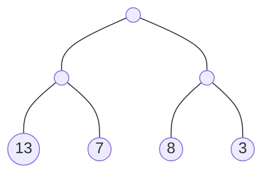
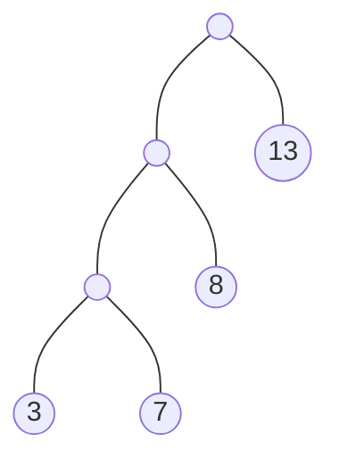

# 哈夫曼树

[TOC]

> 给定 N 个权值作为 N 个叶子节点，构造一棵二叉树，若该树的带权路径长度达到最小，称这样的二叉树为最优二叉树，也称为哈夫曼树(Huffman Tree)。哈夫曼树是带权路径长度最短的树，权值较大的结点离根较近。

### 最优二叉树

树的带权路径长度：树的带权路径长度规定为所有叶子结点的带权路径长度之和，`记为WPL(weighted path length)`,权值越大的结点离根结点越近的二叉树才是最优二叉树。
其中`WPL`最小的就是哈夫曼树。

该树的最短路径$$WPL=13*2+7*2+8*2+3*2=62$$

$$
WPL=1*13+2*8+3*7+3*3=59
$$

### 哈夫曼树构建步骤

1. 从小到大进行排序，将每一个数据，每个数据都是一个节点，每个节点可以看成是一颗最简单的二叉树

2. 取出根节点权值最小的两颗二叉树

3. 组成一颗新的二叉树，该新的二叉树的根节点的权值是前面两颗二叉树根节点权值的和

4. 再将这颗新的二叉树，以根节点的权值大小再次排序，不断重复1-2-3-4的步骤，直到数列中，所有的数据都被处理，就得到一颗赫夫曼树

