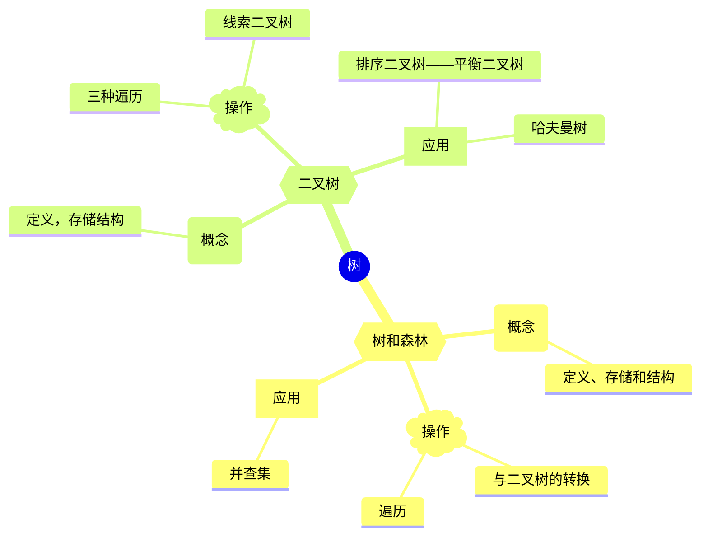
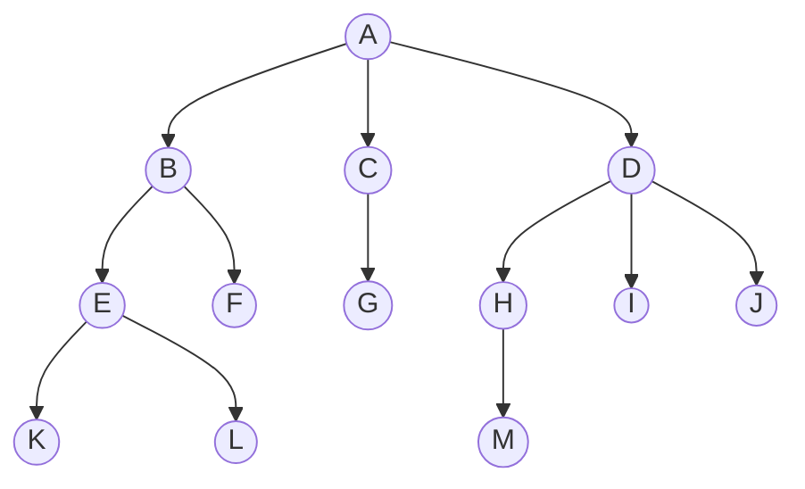
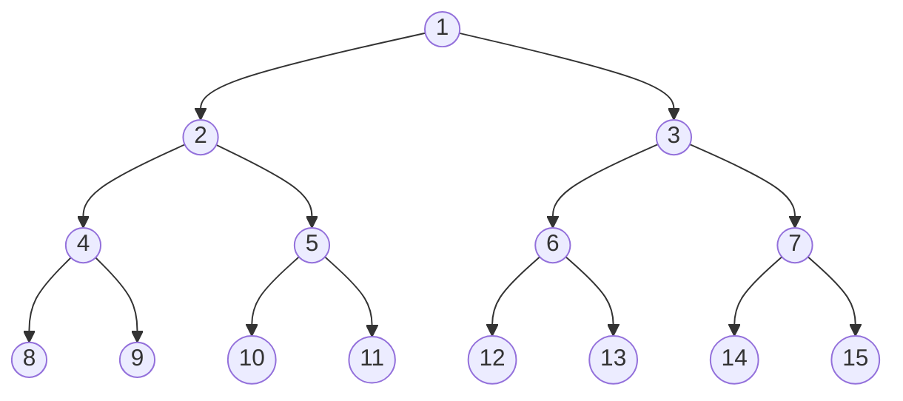
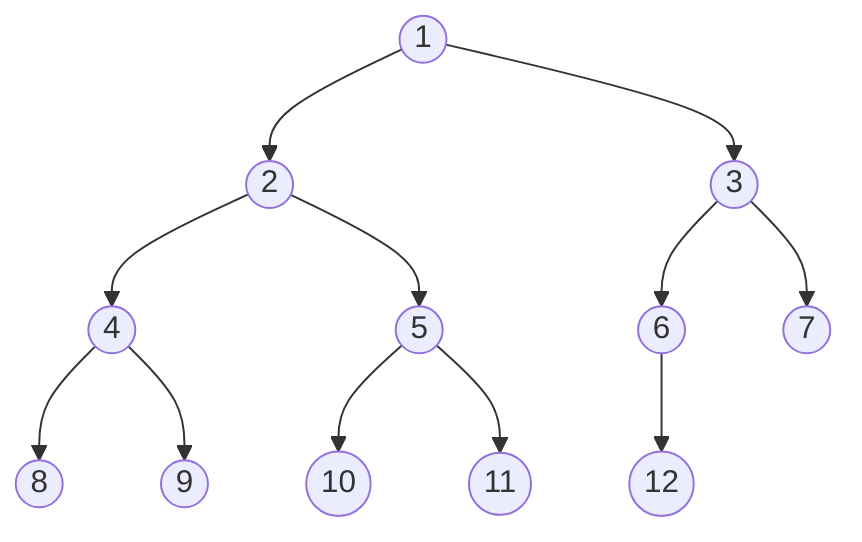

# 树

[TOC]

## 思维导图

### 树的基本概念

1. 树的定义
树是指n(n>=0)个结点的有层次关系的集合，n=0时，树被称为空树，任意一颗非空树满足:

- 有且仅有一个结点作为树的根
- n>0时，其它的结点可以分为m个互不相交的有限集($T_1$,$T_2$,...$T_m$),其中每个集合都是树，称为根的子树。

- 树的根结点没有前驱，并且除根结点的所有结点有且只有一个前驱。所以推论得到一个有n个结点的树有(n-1)条边。
- 树的所有结点可以有零个或多个后继。

2. 基本术语

>- 根据结点K来看，从根结点A到K的路径中，经过的任意路径下的结点都称为K的祖先结点。包括结点A,B,E;最接近K结点的结点E称为K的双亲，而K称为E的孩子，拥有相同双亲的结点称为兄弟，比如结点L就是结点K的兄弟；根是树中唯一一个没有双亲的结点。
>- 树中，结点的孩子个数称为结点的度，而所有结点中最大的度称为树的度，比如结点E的度为2，而结点D的度最大为3，所以该树的度为3。
>- 度大于0的结点称为分支结点，度为0的结点称为叶子结点，分支结点中，每个结点的分支数就是该结点的度。
>- 结点的深度，高度和层次:
>结点的层次从根结点开始，根结点为第一层，B,C,D为第二层，同时，双亲结点在同一层的结点互为堂兄弟，G结点与E,F,H,I,J就互为堂兄弟。
>结点的高度则相反，叶子结点所在的为第一层，根结点为最高层。
>树的高度为结点的最大层数，该树高度为4。
>- 有序树和无序树，树中的各个子树从左到右有顺序的树称为有序树，否则为无序树。
>- 路径和路径长度，两个结点之间的路径是由经过两个结点的其它结点的序列组成，路径长度是路径所经过的边的个数。
>- 森林，森林是由m(m>=0)棵互不相交的树的集合。

3. 基本性质

- 树的结点数等于所有结点的度数+1
- 度为m的树中第i层上最多有$m^{i-1}$个结点(i>=1)
- 高度为h的m叉树最多有$(m^h-1)/(m-1)$个结点
- 具有n个结点的m叉树的最小高度为$log_m(n(m-1)+1)$

### 二叉树

1. 定义
二叉树是一种特殊的树结构，每个结点最多只有两个子树，并且子树有左右之分，不能随意颠倒顺序。
2. 特殊的二叉树

- 斜树：所有结点只有左子树的二叉树称为左斜树，所有结点只有右子树的二叉树称为右斜树。
- 满二叉树：高度为h且结点为$2^h-1$的树叫做满二叉树，树的每层都有最多的结点，并且叶子结点都在最下层，除叶子结点外每个结点的度数为2；按顺序排列，如果叶子结点的编号为i，则它的双亲编号为$i/2$，如果有左孩子，则左孩子编号为$2i$，如果有右孩子，右孩子编号为$2i+1$

- 完全二叉树：高度为h，结点数为n的二叉树，并且从1-n的编号和满二叉树完全相同的树叫做完全二叉树。如果$i<=n$则说明结点i为分支结点不是叶子结点；叶子结点只可能在层次最大的两层出现，最大层次中的叶子结点都在最左边的位置依次排列；如果有度为1的结点，则有且只有一个，**并且该结点只有左孩子**；如果只有左孩子的结点编号为i那么编号大于i的结点都为叶子结点；如果n为奇数，则每个分支结点都有左孩子和右孩子，如果n为偶数，则编号最大的分支结点($n/2$)只有左孩子，没有右孩子，其它的分支结点左右孩子都有。

- 二叉排序树(二叉搜索树,BST):左子树的所有结点关键字小于根结点的关键字，右子树的所有结点关键字大于根结点关键字，左子树和右子树又各是一个排序树。

3. 二叉树的性质

- 非空二叉树的叶子结点的个数等于度为2的结点+1:$n_o=n_2+1$
- 非空二叉树上第k层上至多有$2^{k-1}$个结点(k>=1)
- 高度为h的二叉树至多有$2^h-1$个结点(k>=1)
-
