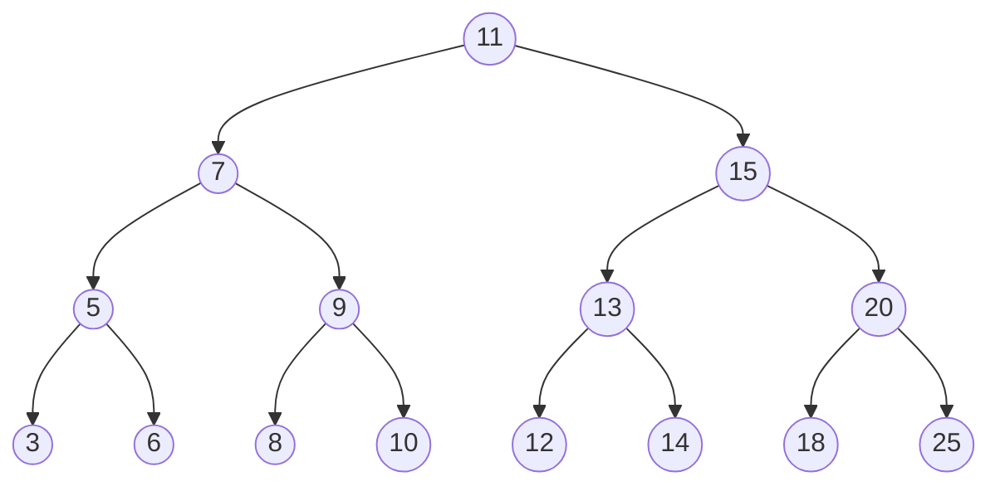

# 树的实现

[TOC]

## 类的建立

树结点类:

```ts
export class TreeNode<T> {
  public value: T;
  public left: TreeNode<T> | null;
  public right: TreeNode<T> | null;
  constructor(value: T) {
    this.value = value;
    this.left = this.right = null;
  }
}
```

二叉搜索树`BST`:

```ts
export class BinarySearchTree<T> {
  public root: TreeNode<T> | null;
  constructor() {
    this.root = null;
  }
  public compareFn(a: T, b: T): number {
    if (a === b) return 0;
    return a < b ? 1 : -1;
  }
}
```

### 方法实现

- insert(key)：向树中插入一个新的键。

```ts
    public insert(value: T) {
        if (this.root === null) {
            this.root = new TreeNode(value)
        } else {
            this.insertNode(this.root, value)
        }
    }

    public insertNode(node: TreeNode<T>, value: T) {
        if (this.compareFn(value, node.value) === -1) {
            if (node.right === null) {
                node.right = new TreeNode(value)
            } else {
                this.insertNode(node.right, value)
            }
        } else {
            if (node.left === null) {
                node.left = new TreeNode(value)
            } else {
                this.insertNode(node.left, value)
            }
        }
    }
```

> 方法`insert(value)`传入插入的值，首先判断树的根结点是否为空，如果为空就将根结点赋值，如果不为空调用 insertNode 方法。
> 方法`insertNode(TreeNode,value)`首先比较传入的结点和值的大小比较，如果值<根，说明应该插入左子树，如果该结点的左孩子为空就值机插入，否则继续调用 insertNode 递归调用；值>根说明应该插入右子树，如果右孩子为空值机插入，否则继续调用 insertNode 做递归。
>通过该方法连续调用

``` ts
const tree=new BinarySearchTree()

tree.insert(11)
tree.insert(7)
tree.insert(15)
tree.insert(5)
tree.insert(3)
tree.insert(9)
tree.insert(8)
tree.insert(10)
tree.insert(13)
tree.insert(12)
tree.insert(14)
tree.insert(20)
tree.insert(18)
tree.insert(25)
tree.insert(6)
```

上面代码得到的二叉树结构:



- inOrderTraverse()：通过中序遍历方式遍历所有节点。

```ts
  public inOrderTraverse() {
    this.inOrderTraverseNode(this.root)
  }

  public inOrderTraverseNode(node: TreeNode<T> | null) {
    if (node !== null) {
      this.inOrderTraverseNode(node.left);
      console.log(node.value);
      this.inOrderTraverseNode(node.right);
    }
  }
```

>首先判断传入的结点是否为空结点，如果不为空则先递归调用自身，传入结点的左孩子，然后输出该结点的value，然后再传入自身结点的右孩子递归调用。
>通过中序遍历得到了中序遍历二叉树的顺序

```ts
tree.inOrderTraverse()
// 3 5 6 7 8 9 10 11 12 13 14 15 18 20 15
```

- preOrderTraverse()：通过先序遍历方式遍历所有节点。

```ts
  public preOrderTraverse(){
    this.preOrderTraverseNode(this.root)
  }

  public preOrderTraverseNode(node:TreeNode<T>| null){
    if (node !== null) {
        console.log(node.value);
        this.preOrderTraverseNode(node.left);
        this.preOrderTraverseNode(node.right);
      }
  }
```

>首先判断传入的结点是否为空结点，如果不为空则先输出自身 value，然后传入自身的左孩子进行递归，最后传入右孩子进行递归。
>输出二叉树顺序:

```ts
tree.preOrderTraverse()
// 11 7 5 3 6 9 8 10 15 13 12 14 20 18 25
```

- postOrderTraverse()：通过后序遍历方式遍历所有节点。

```ts

  public postOrderTraverse() {
    this.postOrderTraverseNode(this.root)
  }

  public postOrderTraverseNode(node: TreeNode<T> | null) {
    if (node !== null) {
        this.postOrderTraverseNode(node.left);
        this.postOrderTraverseNode(node.right);
        console.log(node.value);
      }
  }
```

>后序遍历和先序相反，先递归传入左孩子，然后右孩子，最后输出自身
>后序遍历顺序:

```ts
tree.postOrderTraverse()
// 3 6 5 8 10 9 7 12 14 13 18 25 20 15 11
```

- min()：返回树中最小的值/键。
- max()：返回树中最大的值/键。

在`BST`中，最小值就在最左边的结点上，最大值就在最右边的结点上。

最小值:

```ts
  public min() {
    return this.minValue(this.root);
  }

  public minValue(node: TreeNode<T> | null): T {
   let current=node
   while(current!==null&&current.left!==null){
    current=current.left
   }
   return current!.value
  }
```

>从根一直向左孩子寻找，找到最后的左孩子就是最小值,最大值就从右孩子找。

``` ts
console.log(tree.min())
console.log(tree.max())
// 3 25
```

- search(key)：在树中查找一个键，如果节点存在，则返回 true；如果不存在，则返回 false。

```ts
  public search(value: T) {
    console.log(this.searchNode(this.root, value))
  }
  public searchNode(node: TreeNode<T> | null, value: T) {
    if (node === null) {
      return false;
    }
    if (this.compareFn(node.value, value) === 0) {
      return true;
    } else if (this.compareFn(node.value, value) === -1) {
      return this.searchNode(node.left, value);
    } else if (this.compareFn(node.value, value) === 1) {
      return this.searchNode(node.right, value);
    }
  }
```

>查找值时，从根开始找，如果结点为null直接返回false，否则和结点值进行比较，如果目标值>结点值，就找结点值更大的右孩子，反之找左孩子。

```ts
tree.search(10)
tree.search(50)
tree.search(3)
tree.search(25)
tree.search(100)
//true false true true false
```

- remove(key)：从树中移除某个键。
