# 图

[TOC]

## 思维导图

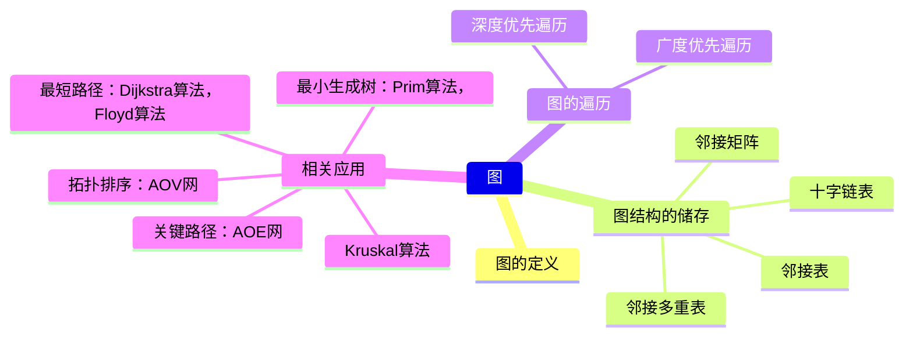

### 图的定义

图(Graph)是由顶点$V(G)$和边$E(G)$组成的，一般表示图为：$G=(V,E)$,$V$是图中顶点的集合，用$|V|$表示图的顶点，也叫图的阶；$E$是图中边的集合，用$|E|$来表示图中的边。

> 线性表可以为空，树也可以为空，但是图不能为空，不存在空图，图中边的集合 E 可以为空，但是图中顶点的集合 V 不能为空。

#### 基本概念和术语

- 有向图
  如果图的边是有向边(弧)，说明图为有向图，同时两个顶点和边的连接叫做弧，用$<v,w>$表示，其中 v,w 是顶点，v 是弧尾，w 是弧头，$<v,w>$就是从顶点 v 到顶点 w 的弧，也叫 v 邻接 w。

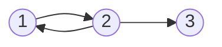

> 若要表示该图
> $G=(V_1,E_1)$ >$V_1={1,2,3}$ >$E_1={<1,2>,<2,3>,<2,1>}$

- 无向图
  当图的边是无向边(边)时，说明图为无向图，记为$<v,w>$并且$<v,w>=<w,v>$说明顶点 v 和顶点 w 互为邻接点。

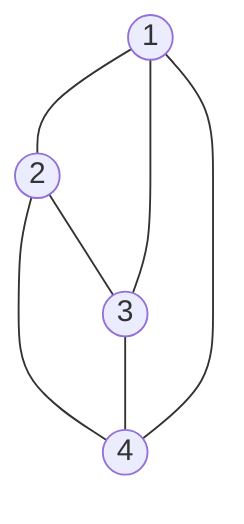

> 表示无向图:
> $G=(V_1,E_1)$ >$V_1={1,2,3,4}$ >$E_1={<1,2>,<1,3>,<1,4>,<2,3>,<2,4>,<3,4>}$

- 简单图：简单图满足两个条件：1.不存在重复的边；2.不存在顶点到自身的边。数据结构只讨论简单图。

- 多重图：如果图满足：某两个结点之间边数多于一条，并且顶点允许和自身相连，那该图就是一个多重图，多重图和简单图是相对的。

- 完全图(完全简单图)：无向图中，边数$(0<E<n(n-1)/2)$，在完全图中，任意两个顶点都有边；对于有向图，因为$<v,w>!=<w,v>$，所以完全图在有向的情况下边数$0<E<n(n-1)$是无向图的两倍。

- 子图：对于两个图 $G=(V,E)$ 和 $G^`=(V^`,E^`)$ ，如果 $V^`$ 是 V 的子集，且 $E^`$ 是 E 的子集，说明$G^`$是 G 的子图，如果 $V(G^`)=V(G)$，说明$G^`$是 G 的生成子图。

- 连通，连通图和连通分量

> 连通:在无向图中，其中两个顶点之间都存在路径，则说明这两个顶点是连通的；如果该图中任意两个顶点都存在路径，则说明该图是连通图，否则为非连通图；无向图的极大连通子图为**连通分量**；如果一个图有 n 个顶点，并边数小于 n-1，则说明该图必是一个非连通图。
> 极大极小连通子图：极大连通子图表示连通子图包含所有的边，极小指包含最少的边。

- 强连通图，强连通分量：强连通是针对有向图来说的，在有向图中，如果任意两个顶点之间互相存在路径，说明该图为强连通图；有向图的极大强连通子图称为**强连通分量**。

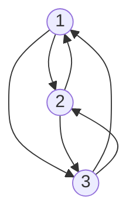

- 生成树，生成森林：连通图的生成树是包含图中全部顶点的一个极小连通子图。若图中顶点数为 n nn,则它的生成树含有 n − 1 n-1n−1 条边。对生成树而言，若砍去它的一条边，则会变成非连通图，若加上一条边则会形成一个回路。在非连通图中，连通分量的生成树构成了非连通图的生成森林。

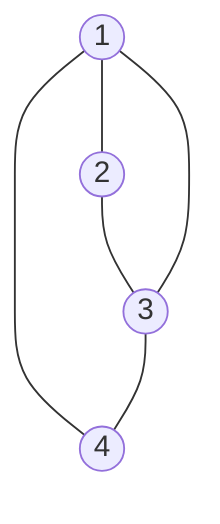

上图的生成树:

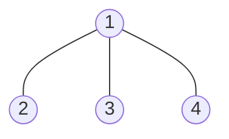

- 顶点的度，入度和出度

对于无向图，顶点的度表示依附于该顶点的边数，记为$TD(v)$，如果一个无向图有 n 个顶点 e 条边，那么度的累加和为：$$\sum_{i=1}^n TD(v_i)=2e$$无向图中全部顶点的度的和为边数的 2 倍，因为一个边连着两个顶点。

对于有向图，顶点的度分为入度和出度，入度指以该顶点为终点的边，用$ID(v)$表示，出度指以该顶点为起点的边，用$OD(v)$表示；有向图中的顶点的度由入度和出度组成$TD(v)=ID(v)+OD(v)$。
如果一个有向图有 n 个顶点 e 条边，那么满足：$$\sum_{i=1}^nID(v_i)=\sum_{i=1}^nOD(v_i)=e$$全部顶点的入度和出度之和等于边数，因为每条边都有一个起点和终点。

- 边的权和网

图中的边都可以增加权值，边上有权值的图称为带权图，也叫网。

- 稠密图，稀疏图

边数很少的图称为稀疏图，反之称为稠密图。稀疏和稠密本身是模糊的概念，稀疏图和稠密图常常是相对而言的。一般当图满足
$|E|<|V|log|V|$可以将该图视为稀疏图。

- 路径，路径长度和回路

顶点$V_p$到顶点$V_q$之间的一条路径是指顶点序列$V_p,V_{i1},V_{i2},V_{i3},...,V_{in},V_q$，当然关联的边也可以理解为路径的构成要素。路径上边的数目称为**路径长度**。第一个顶点和最后一个顶点相同的路径称为回路或环。若一个图有 n 个顶点，并且有大于 n−1 条边，则此图一定有环。

- 简单路径、简单回路
  在路径序列中，顶点不重复出现的路径称为简单路径。除第一个顶点和最后一个顶点外，其余顶点不重复出现的回路称为简单回路。

- 距离
  从顶点 u 出发到顶点 v 的最短路径若存在，则此路径的长度称为从 u 到 v 的距离。若从 u 到 v 根本不存在路径，则记该距离为无穷( ∞ )。

- 有向树
  一个顶点的入度为 0、其余顶点的入度均为 1 的有向图，称为有向树。

### 图的存储结构

图有五种存储的结构

#### 邻接矩阵(Adjacency Matrix)

> 邻接矩阵(Adjacency Matrix)的存储方式是使用两个数组进行存储图的信息，一个存储顶点，另一个存储相应顶点的弧或者边的信息。
> 如果图 G 有 n 个顶点，那么邻接矩阵就是 n\*n 的矩阵，矩阵元素:

$$
A [i] [j]=\begin{cases}
   1, &\text{如果} <v_i,v_j> \text {或者} (v_i,v_j) \text{是图的边} \\>
   0, &\text{如果}<v_i,v_j>\text{或者}(v_i,v_j)\text{不是图的边} \\
\end{cases}
$$

**无向图和邻接矩阵：**

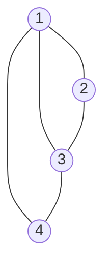

邻接矩阵：

$$
\begin{bmatrix}
    0 & 1 & 1 & 1 \\
    1 & 0 & 1 & 0 \\
    1 & 1 & 0 & 1 \\
    1 & 0 & 1 & 0 \\
\end{bmatrix}
$$

无向图的邻接矩阵一定是一个对称矩阵(即从矩阵的左上角到右下角的主对角线为轴，右上角的元与左下角相对应的元全都是相等的)。 因此，在实际存储邻接矩阵时只需存储上(或下)三角矩阵的元素。
对于无向图，邻接矩阵的第 i 行(或第 i 列)非零元素(或非 ∞ 元素)的个数正好是第 i 个顶点的度$TD( v_i )$。比如顶点$v_1$的度就是$1 + 0 + 1 + 0 = 2 $求顶点 $v_i$的所有邻接点就是将矩阵中第 i 行元素扫描一遍，$A[i][j]$为 1 就是邻接点。

**有向图和邻接矩阵：**

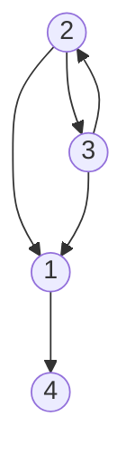

邻接矩阵：

$$
\begin{bmatrix}
    0 & 0 & 0 & 1 \\
    1 & 0 & 1 & 0 \\
    1 & 1 & 0 & 0 \\
    0 & 0 & 0 & 0 \\
\end{bmatrix}
$$

主对角线上数值依然为 0。但因为是有向图，所以此矩阵并不对称。
有向图讲究入度与出度，顶点$2$的入度为 1,正好是第 2 列各数之和。顶点 2 的出度为 2，即第 2 行的各数之和。
与无向图同样的办法，判断顶点$v_i$,到$v_j$是否存在弧，只需要查找矩阵中 $A[i][j]$是否为 1 即可。

**带权图和邻接矩阵：**

如果顶点之间有边，邻接矩阵里面存放着不是 0 或 1，而是对应的权值。

$$
A[i][j]=
\begin{cases}
    W_{ij}, \text{若} (v_i,v_j)∈ E \text{或} <v_i,v_j>∈E  \\
    0, \text{若} i=j \\
    ∞, \text{反之}
\end{cases}
$$

有向网图和邻接矩阵：

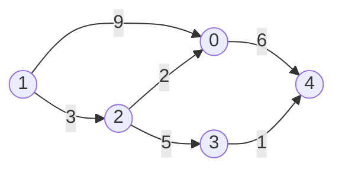

邻接矩阵：

$$
\begin{bmatrix}
    0 & \infty & \infty & \infty & 6 \\
    9 & 0 & 3 & \infty & \infty \\
    2 & \infty & 0 & 5 & \infty \\
    \infty & \infty & \infty & 0 & 1 \\
    \infty & \infty & \infty & \infty & 0 \\
\end{bmatrix}
$$

#### 邻接表

> 当一个图为稀疏图时（边数相对顶点较少），使用邻接矩阵法显然要浪费大量的存储空间,而图的邻接表法结合了顺序存储和链式存储方法，大大减少了这种不必要的浪费。

所谓邻接表，是指对图 G 中的每个顶点$v_i$建立一个单链表，第 i 个单链表中的结点表示依附于顶点$v_i$的边(对于有向图则是以顶点$v_i$为尾的弧)，这个单链表就称为顶点$v_i$的边表(对于有向图则称为出边表)。
邻接表中存在两种结点：顶点表中的结点和边表中的结点，顶点表中结点包括`data`顶点域，`firstarc`边表的头指针域；边表结点包括`adjvex`邻接点域和`nextarc`指针域。

边表的头指针和顶点的数据信息采用顺序存储(称为顶点表)，所以在邻接表中存在两种结点:顶点表结点和边表结点。无向图和其邻接表的表示如下：

- **无向图：**

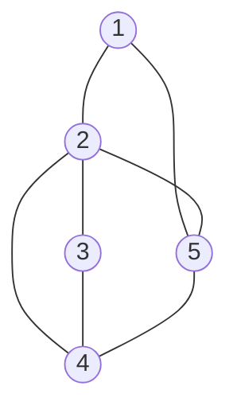

**邻接表：**

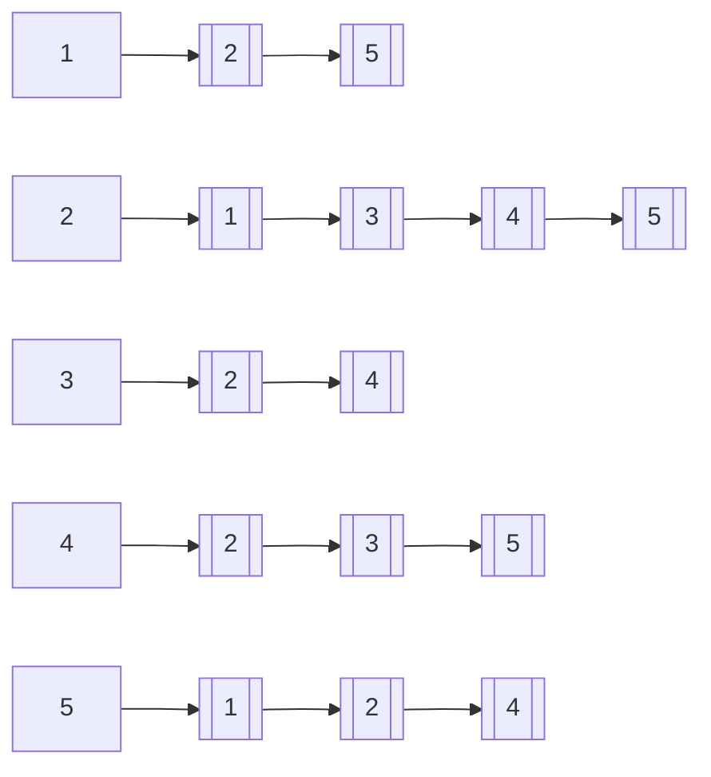

- **有向图：**

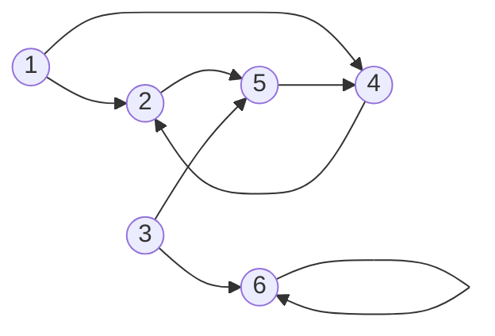

**邻接表：**

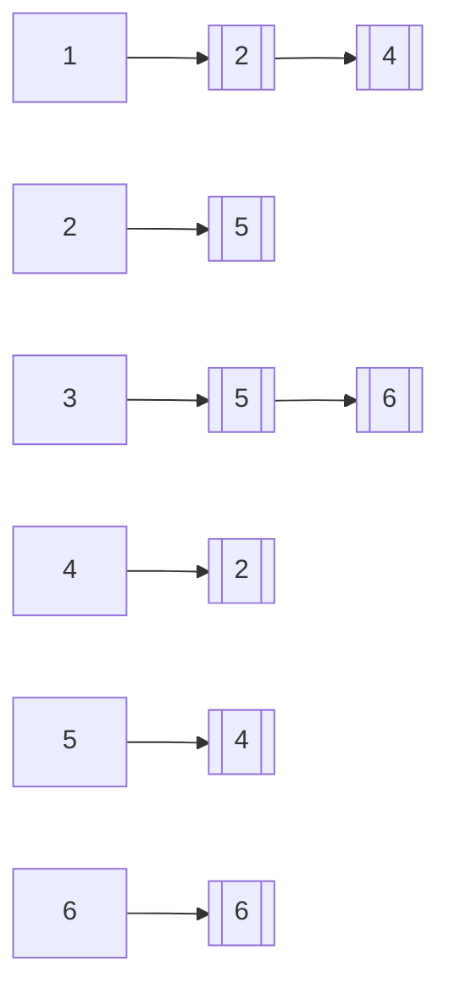

> 对于稀疏图来说,邻接表节省了很大的空间.
> 并且在给定结点的情况下,邻接表可以很快地找到相应结点所连的边.
> 但是邻接表也有一定的缺点,如果在有向图中,如果想要求某个结点的出度,只需要遍历该结点行就可以得到所有出度,但是要是想要得到结点的入度,就需要遍历整个邻接表.后面的十字链表就是针对了这一问题.

#### 十字链表(Orthogonal List)

- 顶点表结构:`data`数据域,`firstIn`入边表头指针,`firstOut`出边表头指针
- 边表结构:`tailVex` 是指弧起点在顶点表的下标，`headVex` 是指弧终点在顶点表中的下标，`headLink` 是指入边表指针域，指向终点相同的下一条边，`tailLink` 是指边表指针域，指向起点相同的下一条边。如果是网，还可以再增加一个 `weight` 域来存储权值。

有向图:

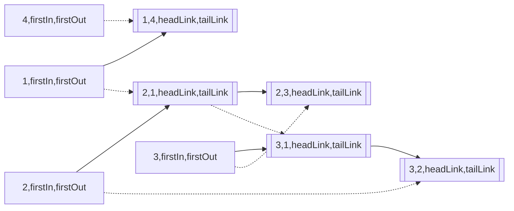

其中顶点到边之间连着实线的表示该顶点为起点,也为出度;顶点到边为虚线的表示顶点为终点,也为入度.
十字链表的好处就是因为把邻接表和逆邻接表整合在了一起， 这样既容易找到以$V_1$为尾的弧，也容易找到以$V_1$为头的弧，因而容易求得顶点的出度和入度。而且它除了结构复杂一点外，其实创建图算法的时间复杂度是和邻接表相同的，因此，在有向图的应用中，十字链表是非常好的数据结构模型。

#### 邻接多重表

> 邻接多重是无向图的另一种链式存储结构,邻接表中,查询顶点之间的关系时很方便,但是如果想要删除两结点之间的边时,需要分别遍历两顶点的边表,然后才能删除.

邻接多重表的边表结点:其中`iVex`和`jVex`是与某条边依附的两个顶点在顶点表中下标.`iLink` 指向依附顶点`iVex`的下一条边,`jLink` 指向依附顶点 `jVex` 的下一条边.
每个顶点也用结点表示:`data`数据域和`firstEdge`指向第一条依附于该顶点的边.

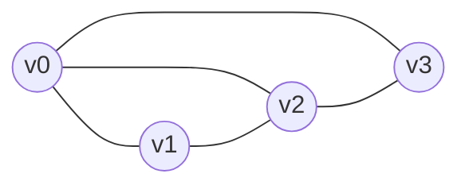

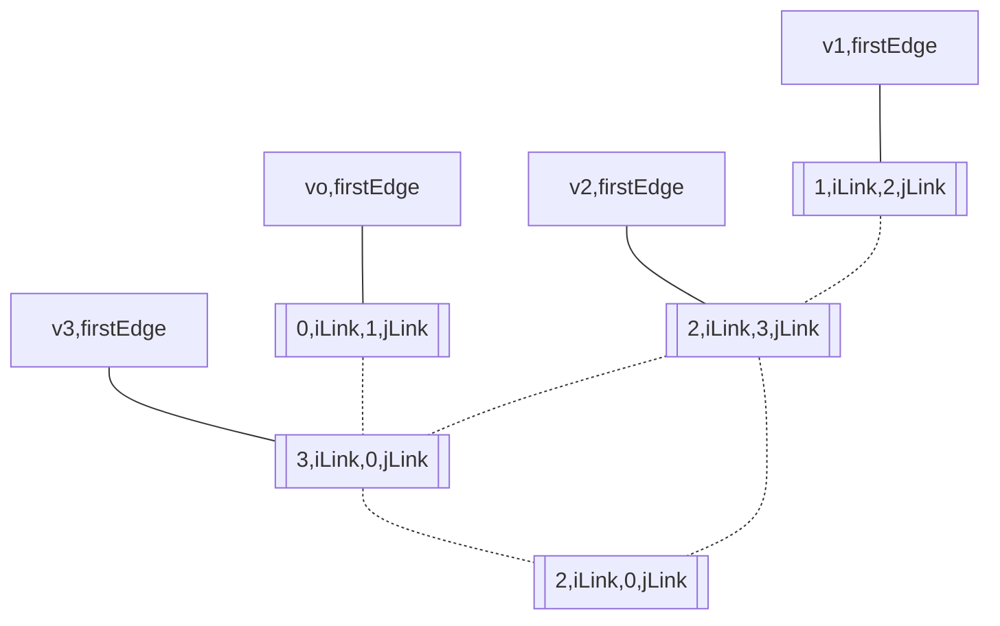

首先顶点连线的就是将顶点的`firstedge`指向一条边，顶点下标要与`iVex`的值相同，由于顶点$v_0$​ 的$( V_0 ,V_1 )$ 边的邻边有$( V_0 , V_3 )$和$(V_0,V_2)$ 所以将它们连接，边与边的连接就是邻边的连接。

#### 边集数组

> 边集数组由两个数组组成，分别是顶点数组和边数组

**有向图：**

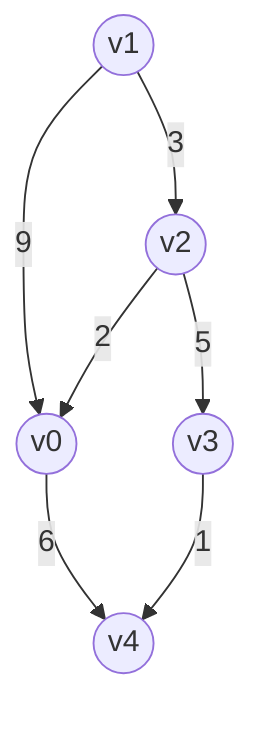

**边集数组：**

顶点数组: $v_0,v_1,v_2,v_3,v_4$
边数组：

|          | begin | end | weight |
| -------- | ----- | --- | ------ |
| edges[0] | 0     | 4   | 6      |
| edges[1] | 1     | 0   | 9      |
| edges[2] | 1     | 2   | 3      |
| edges[3] | 2     | 0   | 2      |
| edges[4] | 2     | 3   | 5      |
| edges[5] | 3     | 4   | 1      |

