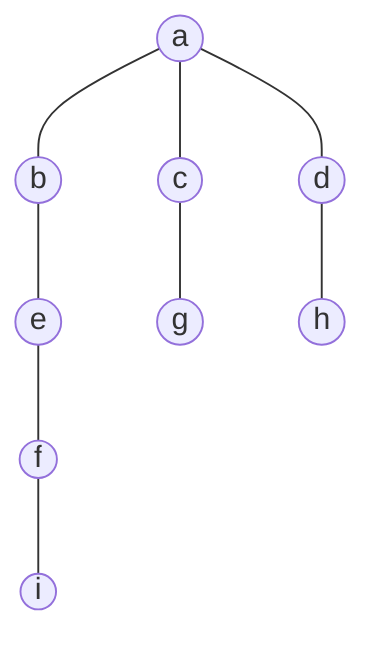

# 图的实现和遍历

[TOC]

## 实现

首先定义图类：

```ts
// 邻接表的方式
export class Graph<T> {
  // 用数组定义顶点
  public vertex: T[];
  //   用map接收边，其中key是顶点，value是顶点连接的边
  public edges: Map<T, T[]>;
  constructor() {
    this.vertex = [];
    this.edges = new Map();
  }
```

**然后定义方法：**

- 插入顶点

```ts
//   添加顶点
  public addVertex(vertex: T) {
    // 顶点数组中添加顶点
    this.vertex.push(vertex);
    // map.set接受key和value，value先设置为空
    this.edges.set(vertex, []);
  }
```

- 添加边

```ts
  //   传入两个顶点，分别在各自的邻接表中添加上各自的引用，两个点组成一个边
  public addEdges(startVertex: T, endVertex: T) {
    this.edges.get(startVertex)?.push(endVertex);
    this.edges.get(endVertex)?.push(startVertex);
  }
```

- 转换为字符串,便于查看

```ts
 //   转换成字符串
  public toString() {
    //1.定义字符串，保存最终结果
    let resultString = ""; //2.遍历所有的顶点以及顶点对应的边
    for (let i = 0; i < this.vertex.length; i++) {
      //遍历所有顶点
      resultString += this.vertex[i] + "-->  ";
      let vEdges = this.edges.get(this.vertex[i]);
      for (let j = 0; j < vEdges!.length; j++) {
        //遍历字典中每个顶点对应的数组
        resultString += vEdges![j] + " ";
      }
      resultString += "\n";
    }
    return resultString;
  }
```

测试

```ts
const graph = new Graph();
const arr = ["a", "b", "c", "d", "e"];
arr.forEach((item) => {
  graph.addVertex(item);
});

graph.addEdges("a", "c");
graph.addEdges("a", "d");
graph.addEdges("a", "b");
graph.addEdges("a", "e");
graph.addEdges("b", "c");
graph.addEdges("b", "d");
graph.addEdges("b", "e");
graph.addEdges("d", "e");

console.log(graph.toString());
// a-->  c d b e
// b-->  a c d e
// c-->  a b
// d-->  a b e
// e-->  a b d
```

## 图的遍历

### 广度优先搜索

广度优先搜索值的是先遍历相邻的顶点，然后继续下一层遍历。

首先创建表示颜色类型的类型`color`

```ts
type color = "white" | "gray" | "black";
```

然后创建 colors 结点成员初始化为 white 表示未被遍历

```ts
  public color: color[];
// constructor(){
    this.color=[]
}
```

三种颜色代表：
`white`:未被遍历.
`gray`:自身被遍历但是相邻的顶点未被遍历完全
`black`:自身和相邻顶点都被遍历过了

先创建初始化颜色的方法`initColor`
```ts
  public initColor(): color[] {

    let colors: color[] = [];

    for (let i = 0; i < this.vertex.length; i++) {

      colors.push("white");

    }

    return colors;

  }
```
在`BFS`广度优先算法方法中：

```ts
%% BFS %%
%% 先初始化所有顶点颜色 %%
this.color=this.initColor()
%% 创建一个队列queue %%
let queue: T[] = [];
%% 创建接收结果的数组res %%
let res: T[] = [];
%% BFS方法接收一个顶点值root作为参数，以这个顶点开始进行遍历 %%
%% 找到root所在的颜色队列的索引并将颜色改为灰色 %%
this.color[this.vertex.findIndex((item: T) => item === root)] = "gray";
%% 将这个顶点存入队列 %%
    queue.push(root);
```

将顶点存入队列后开始循环遍历：

```ts
%% 当队列为空时说明遍历完了 %%
 while (queue.length) {
       %% 创建变量接收刚从队列中弹出的顶点 %%
      let vertex: T = queue.shift()!;
         %% 获取刚刚删除的顶点的邻居顶点 %%
      let vNeighbors = this.edges.get(vertex);
      %% 遍历它的所有邻居结点 %%
      for (let i = 0; i < vNeighbors!.length; i++) {

        const node = vNeighbors![i];
        %% 如果该邻居结点为白色，说明该邻居还没有被遍历过 %%

        if (

          this.color[this.vertex.findIndex((item: T) => item === node)] ===

          "white"

        ) {
        %% 先将邻居置为灰色然后将它也存入队列 %%

          this.color[this.vertex.findIndex((item: T) => item === node)] =

            "gray";

          queue.push(node);

        }

      }
      %% 将刚刚的顶点存入结果集中 %%

      res.push(vertex);
      %% 将遍历完全的顶点置为黑色 %%

      this.color[this.vertex.findIndex((item: T) => item === root)] = "black";

    }
```

测试广度优先算法：

```ts
%% 建立图 %%
const graph = new Graph();

const arr = ["a", "b", "c", "d", "e", "f", "g", "h", "i"];

arr.forEach((item) => {

  graph.addVertex(item);

});

  

graph.addEdges("a", "b");

graph.addEdges("a", "c");

graph.addEdges("a", "d");

graph.addEdges("b", "e");

graph.addEdges("c", "g");

graph.addEdges("d", "h");

graph.addEdges("e", "f");

graph.addEdges("f", "i");
```

图的结构：



遍历结果：

```ts
console.log(graph.toString());
console.log(graph.BFS(graph.vertex[0]));

console.log(graph.BFS(graph.vertex[1]));
%% [
  'a', 'b', 'c',
  'd', 'e', 'g',
  'h', 'f', 'i' 
]
[
  'b', 'a', 'e',
  'c', 'd', 'f',
  'g', 'h', 'i'
] %%
```


### 深度优先搜索

以递归实现，和树的前序搜索逻辑相同：

```ts
  public dfsVisit(vertex: T, colors: color[], res: T[]) {

     %% 将顶点设置为灰色 %%

    colors[this.vertex.findIndex((item: T) => item === vertex)] = "gray";

     %% 将顶点置入队列 %%

    res.push(vertex);

    %%  访问相邻顶点 %%

    let vNeighbors = this.edges.get(vertex) || [];
    %% 循环相邻顶点 %%

    for (let i = 0; i < vNeighbors.length; i++) {

      let node = vNeighbors[i]; 
      %% 判断相邻顶点是否为白色，若为白色，递归调用函数继续访问 %%

      if (

        colors[this.vertex.findIndex((item: T) => item === node)] == "white"

      ) {

        this.dfsVisit(node, colors, res);

      }

    }

  }

  public DFS(root: T): T[] {

    let colors = this.initColor();

    let res: T[] = [];

    this.dfsVisit(root, colors, res);

    return res;

  }
```

测试:

```ts
console.log(graph.DFS(graph.vertex[0]))

console.log(graph.DFS(graph.vertex[1]))

%% 
[
  'a', 'b', 'e',
  'f', 'i', 'c',
  'g', 'd', 'h'
]
[
  'b', 'a', 'c',
  'g', 'd', 'h',
  'e', 'f', 'i'
]
%%
```
