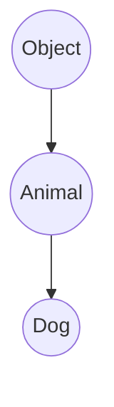

# 面向对象

[TOC]

## public private 和 protected

- public 修饰符修饰的类成员：公有成员可以直接暴露给外部，外部可以直接通过实例化的对象对公有成员进行赋值和访问等操作
- private 修饰符修饰的类成员，只在该类作用域中可以访问到，外部想要访问可以通过类中定义的 getter 和 setter 进行访问和赋值
- protected 修饰符修饰的成员和 private 修饰的成员特性基本相同，但是 protected 类方法可以被该类的子类访问到，而 private 类方法不行。protected 将访问的区域控制在整个继承树中。

## 构造方法

java 中的构造方法：

```java
public class Animal {
    String name;
    int age;
    public  Animal(String name,int age){
        this.name=name;
        this.age=age;
    }
}
```

### 构造方法重载

java 中类可以有多个构造方法，通过定义不同数量或者类型的形参可以进行多个构造方法的创建：

```java
    public Animal(String name, int age) {
        this.name = name;
        this.age = age;
    }

    public Animal() {

    }

    public Animal(String name) {
        this.name = name;
    }
```

在实例化时，通过不同的形参，java 可以自动调用相应的构造方法

> java 中不仅构造方法可以进行重载，普通方法也可以重载

### 继承

java 中类与类之间可以进行继承，子类继承父类的所有属性
使用 extends 关键字进行继承的实现：

父类：Animal.java

```java

public class Animal {
    String name;
    int age;

    public Animal(String name, int age) {
        this.name = name;
        this.age = age;
    }

    public Animal() {

    }

    public Animal(String name) {
        this.name = name;
    }
}
```

子类 Dog.java:

```java
public class Dog extends Animal {
    public  String kind;
    public Dog(String name, int age,String kind) {
        super(name, age);
        this.kind=kind;
    }
}

```

在定义父类的时候，没有写 extends 关键字，但是 java 自动帮这个父类继承了 Object：



**在 java 中只允许类继承自一个类，一个类中有且只有一个父类**

#### super

super 关键字表示父类(超类)子类可以通过 super 关键字访问父类的成员，可以把 super 当作父类的 this

Dog.java

```java
    public void hello(){
        System.out.println(super.name);
    }
```

> 在子类的构造方法中，第一句必须是父类的实例化 super(),这样才拥有子类自己的 this

### 阻止继承

如果某个类没有使用 final 关键字进行修饰，那么它可以被任何类来继承，java15 之后添加了 sealed 关键字，通过该关键字可以决定该类可以被哪些类继承

```java

public sealed class Animal permits Dog
```

这里 animal 类的声明就指定了只有 Dog 类可以继承与它，但是子类也需要进行约束，想要继承一个 sealed 修饰的类，自身也必须是一个被 sealed，final 或者是 non-sealed 关键字修饰的类

```java
public non-sealed class Dog extends Animal
```

### 向上转型

如果一个变量的类型是一个父类，可以使用子类的构造函数来对它进行实例化：

```java
        Animal golden=new Dog("bobby",30,"white");
```

因为子类拥有父类所有的特性，所以子类可以对父类进行实例化

但是相反的，父类不一定拥有子类所有的特性，所以父类的构造函数不可以对子类的变量进行实例化。

> java 可以通过 instanceof 操作符来进行判断一个实例是否是一个类型

```Java
        Dog dog = new Dog("puppy", 20, "golden");
        Animal little_dog = new Animal();
        if (little_dog instanceof Dog) {
            little_dog = (Animal) dog;
        }
```

这里先判断了 animal 类型的变量是否是 dog 类型的实例，判断之后才进行向下的实例化，此时 java 也不会报错。

### 多态

如果子类中有一个和父类命名一样的方法，那么在子类中可以覆写这个方法：

父类 Animal.java

```java
    public void run(){
        System.out.println("I am running");
    }
```

子类 Dog.java
使用覆写签名`@Override`

```java
    @Override
    public void run() {
        System.out.println("dog is running");
    }

```

此时如果分别实例化父类和子类的实例，调用相同的方法输出的结果：

```java
        Animal an=new Animal();
        Dog dog=new Dog();
        an.run();
        dog.run();
//        I am running
//        dog is running
```

他们分别调用自身的方法

如果父类不想让子类覆写某个方法，可以使用 final 关键字来对该方法进行修饰

> 如果某类不想让任何类继承，可以使用 final 修饰

### 抽象

在定义父类时，如果只是想要进行方法签名的定义而不是实现，可以使用 abstract 关键字来将方法声明为抽象方法

```java
public abstract class Person {
    public abstract void run();
}
```

相应的类也被称为抽象类，抽象类不能被实例化。

> 如果一个类是抽象类时，继承它的子类就必须覆写该抽象类上的相应方法。

- 面向抽象编程:

上层代码只定义规范（例如：abstract class Person）；

不需要子类就可以实现业务逻辑（正常编译）；

具体的业务逻辑由不同的子类实现，调用者并不关心。

### 接口

在抽象类中，抽象方法本质上是定义接口规范：即规定高层类的接口，从而保证所有子类都有相同的接口实现，这样，多态就能发挥出威力。

如果抽象类中没有字段，所有方法全是抽象方法时，那么可以把这个抽象类写成一个接口使用 interface 关键字：

```java
interface Person{
}

```

接口中所有方法都默认是抽象的，所以不需要使用 abstract 关键字，并且接口中不能有字段

如果类想实现接口，就需要使用 implement 关键字

> 在 Java 中，一个类只能继承自另一个类，不能从多个类继承。但是，一个类可以实现多个 interface

#### 接口继承

接口和接口之间也可以进行继承，相当于接口的扩展，继承依然使用 extends 关键字

### 静态字段和静态方法

class 类中的普通字段被称之为实例字段，因为这些字段可以在类的实例中被访问，使用 static 关键字修饰的字段称为静态字段，这些字段可以在类本身被访问，静态字段只属于类本身，在实例中去修改静态字段，则其他的实例访问到的静态字段也都被改变了。

同样的，用 static 修饰的方法叫做静态方法，它们都不需要实例去访问，使用类名可以直接访问静态字段和静态方法

#### 接口的静态字段

因为 interface 是一个纯抽象类，所以它不能定义实例字段。但是，interface 是可以有静态字段的，并且静态字段必须为 final 类型：

> 而且接口中的字段只能是 public static final 修饰，所以在接口中可以直接将他们省略

```java
public interface People {
    int MALE = 1;
}

```

### 内部类

一种类可以被定义在一个类的内部，这样的类被称之为内部类：

```java
public class OuterClass {
    OuterClass(){

    }
//    内部类
    public class InnerClass{
        InnerClass(){

        }
    }
}
```

创建一个内部类的实例化：

```java
    public static void main(String[] args) {
        OuterClass outer=new OuterClass();
        OuterClass.InnerClass inner=outer.new InnerClass();
    }
```

创建内部类的实例，要先创建外部类实例，然后通过外部类的实例来创建。

> 因为 Inner Class 除了有一个 this 指向它自己，还隐含地持有一个 Outer Class 实例，可以用 Outer.this 访问这个实例。所以，实例化一个 Inner Class 不能脱离 Outer 实例。Inner Class 可以访问到外部类的 private 成员，因为内部类的作用域在外部类的内部。

### 匿名类(Anonymous Class)

匿名类也是一种定义内部类的方法，它不需要显式地使用 class 关键字去定义：

```java
   public class Outer{
        String name;
        Outer(String name){
            this.name=name;
        }

        void hello(){
            Runnable r=new Runnable() {
                @Override
                public void run() {
                    System.out.println("name is:"+Outer.this.name);
                }
            };
            new Thread(r).start();
        }
    }
```

在方法内部实例化了一个 Runnable。Runnable 本身是接口，接口是不能实例化的，所以这里实际上是定义了一个实现了 Runnable 接口的匿名类，并且通过 new 实例化该匿名类，然后转型为 Runnable。

匿名类实现得语法：

```java
Runnable r = new Runnable() {
    // 实现必要的抽象方法...
};
```

### 静态内部类(Static Nested Class)

静态内部类使用 static 关键字进行修饰：

```java
public class StaticNestedClass {
        static class Nested {
            String name;

            Nested(String name) {
                this.name = name;
            }
    }
}
```

想要使用静态内部类，可以通过外部类直接访问：

```java
    StaticNestedClass.Nested nested=new StaticNestedClass.Nested("aaa");
```

> 用 static 修饰的内部类和 Inner Class 有很大的不同，它不再依附于 Outer 的实例，而是一个完全独立的类，因此无法引用 Outer.this，但它可以访问 Outer 的 private 静态字段和静态方法。如果把 StaticNested 移到 Outer 之外，就失去了访问 private 的权限。
