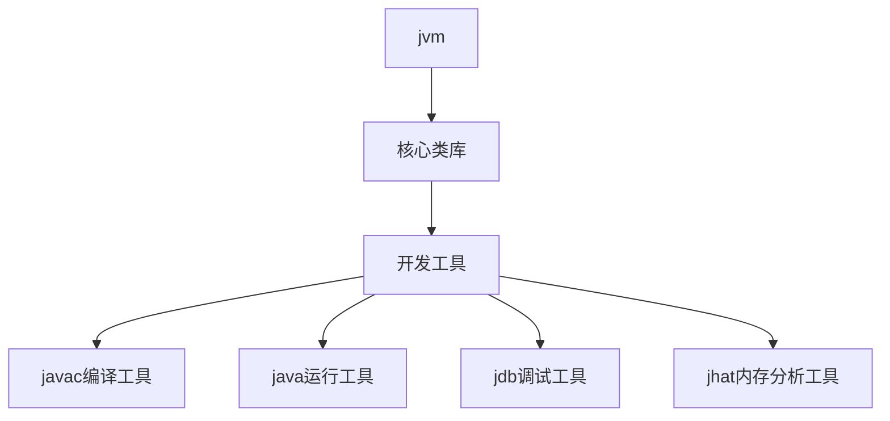

# jdk 和 jre

[TOC]

## jvm

jvm(java virtual machine) 真正运行 java 代码的地方

## jdk

jdk(java development kit) 开发工具包则是上面所有东西的集合。

## jre

jre(java runtime environment) 运行时环境。
在做好java程序后，交给其他人进行运行class文件时,整个包因为已经开发完成，所以不需要再安装jdk和java的开发工具了，所以只需要安装jre即可。jre包含了jvm，核心类库和运行工具