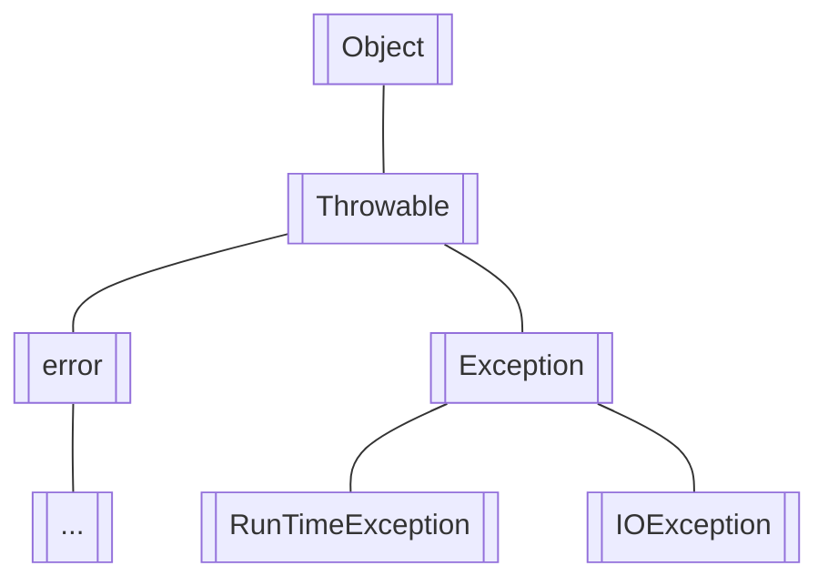

# 异常处理

[TOC]

java 内置了一套异常错误的处理机制，使用异常来表示错误：

```java
  try {
            String s = processFile(“C:\\test.txt”);
            // ok:
        } catch (FileNotFoundException e) {
            // file not found:
        } catch (SecurityException e) {
            // no read permission:
        } catch (IOException e) {
            // io error:
        } catch (Exception e) {
            // other error:
        }
```

java 异常本质也是 class，它的继承关系：



Throwable 是整个异常体系的基类，它由两个类继承，其中 Error 类表示程序出现了严重错误；Exception 是指程序出现了异常，应该对它进行捕获和处理。

Exception 又分为了 RuntimeException 和 IOException

- 必须捕获的异常，包括 Exception 及其子类，但不包括 RuntimeException 及其子类，这种类型的异常称为 Checked Exception。

- 不需要捕获的异常，包括 Error 及其子类，RuntimeException 及其子类。

Java 捕获异常使用`try...catch`语句，把可能发生异常的代码放到 try {...}中，然后使用 catch 捕获对应的 Exception 及其子类：

```java
    static byte[] toGBK(String s) {
        try {
            return s.getBytes("GBK");

        } catch (UnsupportedEncodingException e) {
            System.out.println(e);
            return s.getBytes();
        }
    }
```

## 多 catch 语句

> 可以使用多个 catch 语句，每个 catch 分别捕获对应的 Exception 及其子类。JVM 在捕获到异常后，会从上到下匹配 catch 语句，匹配到某个 catch 后，执行 catch 代码块，然后不再继续匹配。

```java
        try {
//            process1();
//            process2();
//            process3();
        } catch (IOException e) {
//              dosth
        } catch (NullPointerException e) {
//            dosth
        }
```

**多 catch 中，子类的 catch 要在前面，不然永远无法捕获**

在最后无论是否有异常发生，都要执行的语句就放到 finally 关键字包裹的代码块中
