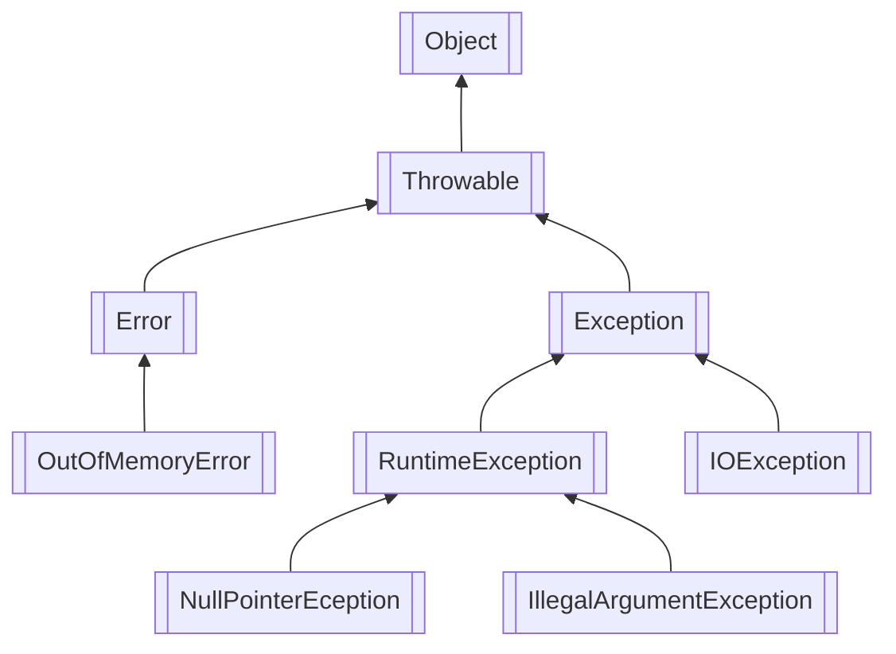

# java 异常处理

[TOC]

java 提供了一套进行异常处理的机制，使用异常机制可以捕获错误。

异常也是 class，只要在上层进行捕获，都可以在下面将它抛出:

```java
        try {
            String s = processFile(“C:\\test.txt”);
            // ok:
        } catch (FileNotFoundException e) {
            // file not found:
        } catch (SecurityException e) {
            // no read permission:
        } catch (IOException e) {
            // io error:
        } catch (Exception e) {
            // other error:
        }
```

java 异常的继承关系:



>继承关系可知：Throwable是异常体系的根，它继承自Object。Throwable有两个体系：Error和Exception，Error表示严重的错误。
>Exception表示非严重错误，可以捕获处理。