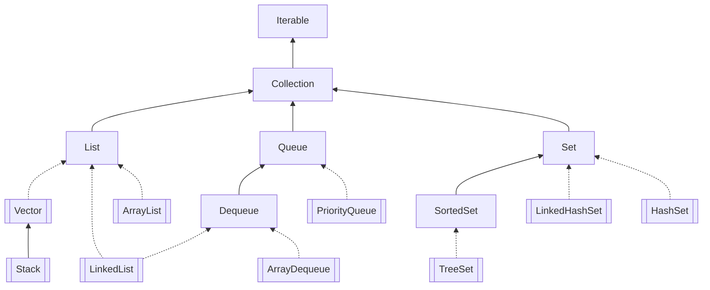

# 集合

[TOC]

> java 中的数组类似于集合，但是数组在初始化后的大小是不可变的，并且数组只能按照索引的顺序进行存取。所以 java 引入了集合。

**继承关系**



其中实线为继承,虚线为实现，双方形为类，单方形为接口

## 顶层接口 Iterable

```java
//支持lambda函数接口
import java.util.function.Consumer;
public interface Iterable<T> {
  //iterator()方法
    Iterator<T> iterator();
    default void forEach(Consumer<? super T> action) {
        Objects.requireNonNull(action);
        for (T t : this) {
            action.accept(t);
        }
    }
    default Spliterator<T> spliterator() {
        return Spliterators.spliteratorUnknownSize(iterator(), 0);
    }
}
```

> Iterable 只有 iterator 一个方法，并且 iterator 也是一个接口，其中有 hasNext()和 next()方法

## Collection

```java
int size();
    boolean isEmpty();
    boolean contains(Object o);
    Iterator<E> iterator();
    Object[] toArray();
    boolean add(E e);
    boolean remove(Object o);
    boolean containsAll(Collection<?> c);
    boolean removeAll(Collection<?> c);
    default boolean removeIf(Predicate<? super E> filter) {
        Objects.requireNonNull(filter);
        boolean removed = false;
        final Iterator<E> each = iterator();
        while (each.hasNext()) {
            if (filter.test(each.next())) {
                each.remove();
                removed = true;
            }
        }
        return removed;
    }
    boolean retainAll(Collection<?> c);
    void clear();
    int hashCode();
    @Override
    default Spliterator<E> spliterator() {
        return Spliterators.spliterator(this, 0);
    }
    default Stream<E> stream() {
        return StreamSupport.stream(spliterator(), false);
    }
    default Stream<E> parallelStream() {
        return StreamSupport.stream(spliterator(), true);
    }
```

Collection 主要接口方法:

| 接口                                | 作用                          |
| ----------------------------------- | ----------------------------- |
| int size();                         | 返回集合的大小                |
| boolean isEmpty()                   | 返回集合是否为空              |
| boolean contains(Object o)          | 是否含有某元素                |
| Iterator iterator()                 | 迭代方法                      |
| Object[] toArray()                  | 转换为数组                    |
| boolean add(E e)                    | 添加元素                      |
| boolean remove(Object o)            | 移除元素                      |
| boolean containsAll(Collection<?>c) | 是否包含另一个集合            |
| boolean removeALl(Collection<?>c)   | 移除集合中所有在集合 c 的元素 |
| boolean retainAll(Collection<?>c)   | 判断集合中不在集合 c 的元素   |
| void clear()                        | 清除所有元素                  |

## List

> java 的集合类中最基础的集合就是 List，List 的行为和数组几乎完全相同：List 内部按照放入元素的先后顺序存放，每个元素都可以通过索引确定自己的位置，List 的索引和数组一样，从 0 开始。

```java
public interface List<E> extends Collection<E> {
    <T> T[] toArray(T[] a);

    boolean addAll(Collection<? extends E> c);

    boolean addAll(int index, Collection<? extends E> c);

    default void replaceAll(UnaryOperator<E> operator) {
        Objects.requireNonNull(operator);
        final ListIterator<E> li = this.listIterator();
        while (li.hasNext()) {
            li.set(operator.apply(li.next()));
        }
    }

    default void sort(Comparator<? super E> c) {
        Object[] a = this.toArray();
        Arrays.sort(a, (Comparator) c);
        ListIterator<E> i = this.listIterator();
        for (Object e : a) {
            i.next();
            i.set((E) e);
        }
    }

    boolean equals(Object o);

    E get(int index);

    E set(int index, E element);

    void add(int index, E element);

    int indexOf(Object o);

    int lastIndexOf(Object o);

    ListIterator<E> listIterator();

    List<E> subList(int fromIndex, int toIndex);

    @Override
    default Spliterator<E> spliterator() {
        return Spliterators.spliterator(this, Spliterator.ORDERED);
    }
}
```

>可见List比Collection多了添加方法`add`和`addAll`，查找方法`get`,`indexOf`,`set`等方法，并且支持index下标操作。Collection和List最大的区别就是Collection是无序的，不支持索引操作，而List是有序的。Collection没有顺序的概念；List中Iterator为ListIterator；List接口支持使用`sort`方法；List和Collection的`Spliterator`操作方式不一样。