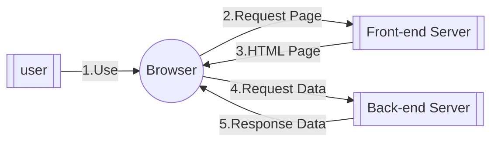
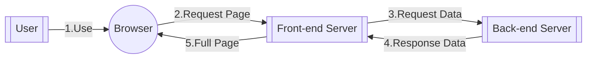

# 服务端渲染

[TOC]

## 服务端渲染和客户端渲染的区别

- 客户端渲染:

```mermaid
graph LR
1[[user]]--1.Use-->2((Browser))
2((Browser))--2.Request Page-->3[[Front-end Server]]
3[[Front-end Server]]--3.HTML Page-->2((Browser))
2((Browser))--4.Request Data-->4[[Back-end Server]]
4[[Back-end Server]]--5.Response Data-->2((Browser))
```

- 服务端渲染:

```mermaid
graph LR
1[[User]]--1.Use-->2((Browser))
2((Browser))--2.Request Page-->3[[Front-end Server]]
3[[Front-end Server]]--5.Full Page-->2((Browser))
4[[Back-end Server]]--4.Response Data-->3[[Front-end Server]]
3[[Front-end Server]]--3.Request Data-->4[[Back-end Server]]
```
