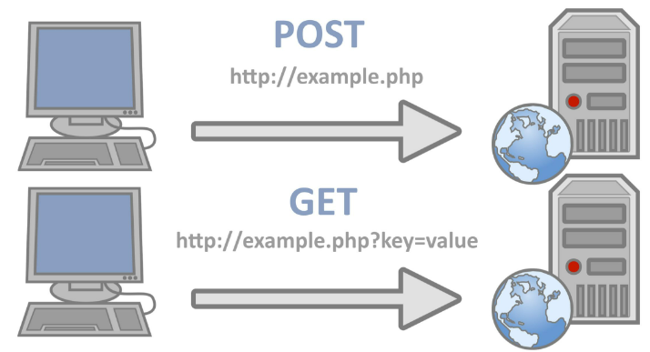

# XHR向服务器请求


[TOC]

### 发送请求

将请求发送至服务器要使用XMLHttpRequest的open()和send()方法。

```
xmlhttp.open("GET","ajax_info.txt",true);
xmlhttp.send();
```

| 方法                         | 描述                                                         |
| :--------------------------- | :----------------------------------------------------------- |
| open(*method*,*url*,*async*) | 规定请求的类型、URL 以及是否异步处理请求。*method*：请求的类型；GET 或 POST*url*：文件在服务器上的位置*async*：true（异步）或 false（同步） |
| send(*string*)               | 将请求发送到服务器。*string*：仅用于 POST 请求               |

### POST请求和GET请求

与 POST 相比，GET 更简单也更快，并且在大部分情况下都能用。

然而，在以下情况中，请使用 POST 请求：

- 不愿使用缓存文件（更新服务器上的文件或数据库）
- 向服务器发送大量数据（POST 没有数据量限制）
- 发送包含未知字符的用户输入时，POST 比 GET 更稳定也更可靠



**简单GET请求**

```
x.open("GET","xxxx.php",true);
x.send();
```

简单请求可能得到的是缓存的结果

**可以向url中添加ID**

```
x.open("GET","xxxxxx.ID",true);
x.send();
```

**GET方法发送消息**

```
x.open("GET","xxxxx?name=xxx&id=xxxx",true);
x.send();
```

**简单POST请求**

```
x.open("POST","xxxxxx",true);
x.send();
```

**提交表单或者其他数据**

```
x.open("POST","xxxxx",true);
//添加HTTP头
x.setRequestHead("header","value");
x.send("name=xxx&id=xxxx");
```

| 方法                             | 描述                                                         |
| :------------------------------- | :----------------------------------------------------------- |
| setRequestHeader(*header,value*) | 向请求添加 HTTP 头。*header*: 规定头的名称*value*: 规定头的值 |

其中open中url的参数是服务器上的文件，可以是任何类型的文件

true和false值的是异步或者同步

对于 web 开发人员来说，发送异步请求是一个巨大的进步。很多在服务器执行的任务都相当费时。AJAX 出现之前，这可能会引起应用程序挂起或停止。

通过 AJAX，JavaScript 无需等待服务器的响应，而是：

- 在等待服务器响应时执行其他脚本
- 当响应就绪后对响应进行处理