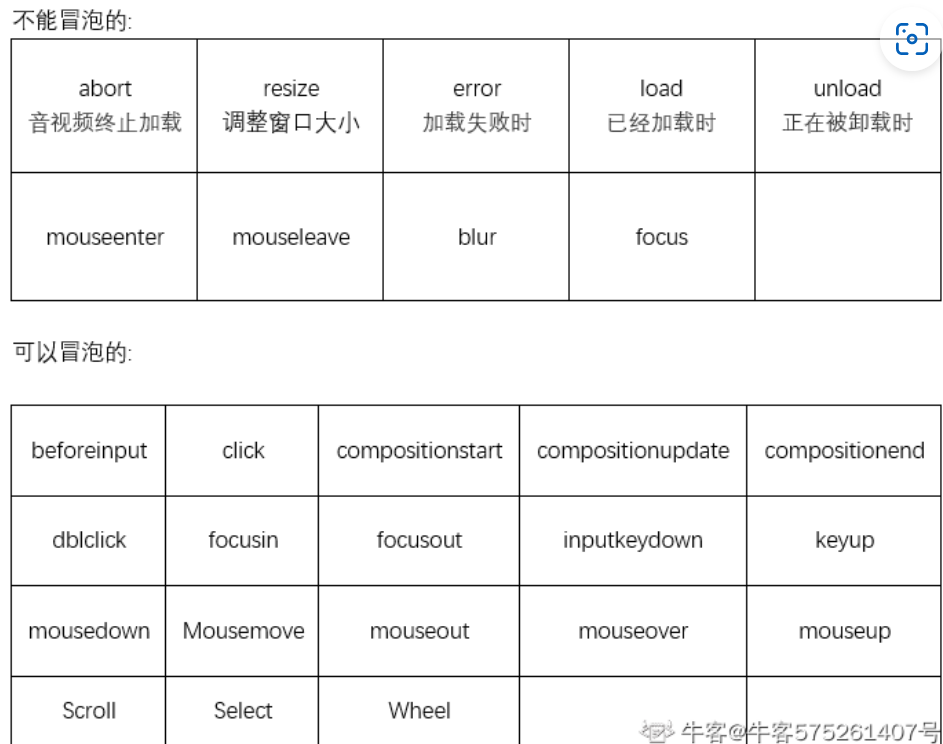

# 事件冒泡和事件捕获


[TOC]

### 能否冒泡的事件



### DOM事件流


通常事件流可以分为三个阶段：**捕获阶段，目标阶段，冒泡阶段**

​	捕获阶段是指事件响应从最外层的Window开始，逐级向内层前进，直到具体事件目标元素。在捕获阶段，不会处理响应元素注册的冒泡事件。

目标阶段指触发事件的最底层的元素，如上图中的。

冒泡阶段与捕获阶段相反，事件的响应是从最底层开始一层一层往外传递到最外层的Window。

DOM事件流的三个阶段是**先捕获阶段，然后是目标阶段，最后才是冒泡阶段**。

**事件代理就是利用事件冒泡或事件捕获的机制把一系列的内层元素事件绑定到外层元素。**

### 事件冒泡和事件捕获

##### 事件冒泡

事件冒泡举例:

```
<div id="father" class="father">
    <div id="son" class="son">
      <div id="baby" class="baby"></div>
    </div>
  </div>
</body>
<script>
  let father=document.getElementById('father')
  let son=document.getElementById('son')
  let baby=document.getElementById('baby')
  
  father.addEventListener('click',function(){
    console.log('father')
  })
  son.addEventListener('click',function(){
    console.log('son')
  })
  baby.addEventListener('click',function(){
    console.log('baby')
  })
```

当点击到最小的`div`时，执行点击事件的顺序为baby->son->father,点击到中等大小的`div`时，执行顺序为son->father，说明事件冒泡的顺序是由内而外的执行顺序。

##### 事件捕获

```
  //事件捕获
   father.addEventListener('click',function(){
    console.log('father')
  },true)
  son.addEventListener('click',function(){
    console.log('son')
  },true)
  baby.addEventListener('click',function(){
    console.log('baby')
  },true)
```

执行顺序是father->son->baby，是由外向内的执行顺序，和事件冒泡完全相反。

##### 先注册冒泡再注册捕获

当先注册冒泡事件再注册捕获事件时：

```
//事件冒泡
  father.addEventListener('click',function(){
    console.log('冒泡father')
  })
  son.addEventListener('click',function(){
    console.log('冒泡son')
  })
  baby.addEventListener('click',function(){
    console.log('冒泡baby')
  })


   //事件捕获
   father.addEventListener('click',function(){
    console.log('捕获father')
  },true)
  son.addEventListener('click',function(){
    console.log('捕获son')
  },true)
  baby.addEventListener('click',function(){
    console.log('捕获baby')
  },true)
```

执行顺序:**捕获father->捕获son->捕获baby->冒泡baby->冒泡son->冒泡father**（chrome浏览器下执行）

在firefox浏览器下执行则根据你点击的那个元素先注册的是冒泡还是捕获，如果先注册冒泡则先执行冒泡，如果先注册捕获则执行捕获。

所以上面的代码执行在firefox上的打印结果是不一样的：**捕获father->捕获son->冒泡baby->捕获baby->冒泡son->冒泡father**

### 事件代理

**事件代理就是利用事件冒泡或事件捕获的机制把一系列的内层元素事件绑定到外层元素。**

如果对于上面的三个div中点击每一个都会打印它们的同一属性，或者输出同一样的数据，我们可以通过事件代理，将多个事件监听器减少为一个，这样就减少代码的重复编写了。

```
    //事件代理
    father.addEventListener('click',function(e){
      console.log(`捕获${e.target.className}`)
    },true)
    father.addEventListener('click',function(e){
      console.log(`冒泡${e.target.className}`)
    })
```

最后不论是点击baby还是son，或者只是father，它们都会输出对应的className