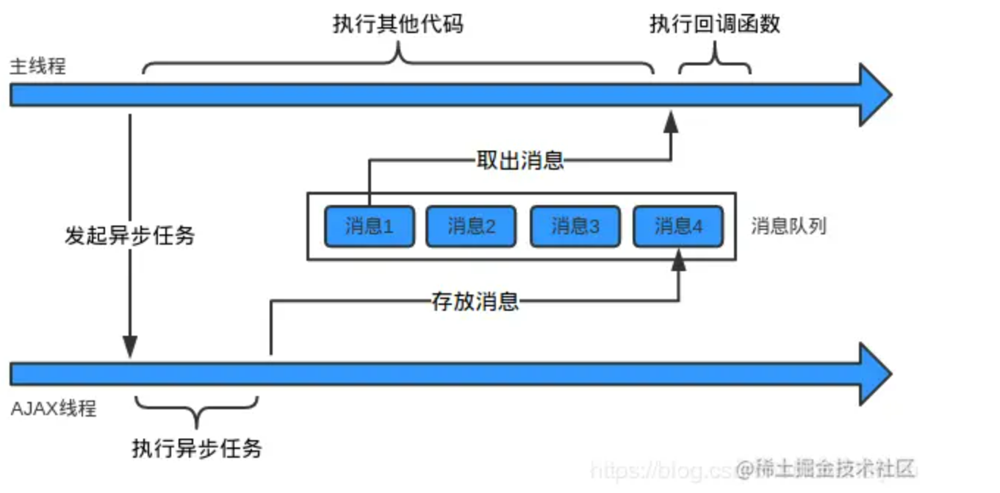

# 单线程和异步


[TOC]

### 单线程

单线程指在JavaScript引擎中负责解释和运行的线程唯一，同一时间只能执行一个任务。

##### **JavaScript为什么要引入单线程**？

因为浏览器需要渲染DOM，JavaScript可以修改DOM，同时，在执行JavaScript时浏览器会停止渲染DOM，如果JavaScript不是单线程的话，同时执行多段JavaScript，如果多段JavaScript都涉及到了修改DOM，那么会出现DOM冲突。

为了避免DOM冲突，可以引入锁的方法来解决冲突，但是提高了复杂性，所以JavaScript就引入了单线程

单线程实现比较简单，而且执行的环境相对比较单纯。

##### 引入单线程的局限

引入单线程意味着在一个线程内，只允许执行一个任务，一旦某个任务执行事件过长，那么后面的任务只能在后面等待，这样会拖延整个程序的执行。

浏览器的无响应一般是因为某个任务执行时间过长，导致整个页面卡住，其他任务无法执行。

为了解决此局限性，JavaScript引入了同步和异步的概念。

### 同步和异步

##### 同步

```js
func(args...)
```

如果在函数返回时，执行者可以立即得到函数的返回值，那么这就是同步。

##### 异步

如果在函数返回时，执行者不能立即得到返回的值，而是需要一定手段来得到返回值，那么它就是异步。

**采用异步的原因：**

JavaScript是单线程

提高CPU利用率

### 异步的过程

```js
fs.readFile('data.json', 'utf8', function(err, data) {
    console.log(data)
})
```

  在执行`readfile`后，不会立刻打印`data`而是在读取完`data.json`后才会打印。

  也就是异步函数 `fs.readFile` 执行很快，但后面还有工作线程执行异步任务、通知主线程、主线程回调等操作，这个过程就叫做异步过程。

  **主线程发起一个异步操作，相应的工作线程接受请求并告知主线程已收到（异步函数返回）；主线程继续执行后面的任务，同时工作线程执行异步任务；工作线程完成任务后，通知主线程；主线程收到通知后，执行一定的动作（调用回调函数）。**

### 消息队列和事件循环

**工作线程(子线程)把返回的消息放到消息队列，然后主线程在事件循环中得到消息**

- 消息队列：消息队列是一个先进先出的队列，它里面存放着各种消息。
- 事件循环：事件循环是指主线程重复从消息队列中取消息、执行的过程。

##### 事件循环(event loop)

主线程从事件循环中不断的取消息，执行消息，此过程称为事件循环，这样的机制叫做事件循环机制，一次取消息并且执行的过程叫做一次循环

大概的实现过程：

```js
while(true) {
    var message = queue.get()
    execute(message)
}
```

**事件循环是JavaScript实现异步的具体解决方案，其中同步代码，直接执行；异步函数先放在异步队列中，待同步函数执行完毕后，轮询执行 异步队列 的回调函数。**

##### 消息队列

消息队列其中的消息就是子线程在注册异步任务时的回调函数。比如：

```js
$.ajax('XXX', function(res) {
    console.log(res)
})
...
```

主线程在发出ajax请求后，继续执行其他任务，而子线程负责ajax请求，在拿到请求后会将其封装成JavaScript对象，然后构造一条消息：

```js
// 消息队列里的消息
var message = function () {
    callback(response)
}
```

其中`callback`就是ajax网络请求成功的回调函数	

主线程在执行完当前循环中的所有代码后，就会到消息队列取出这条消息(也就是 `message` 函数)，并执行它。到此为止，就完成了工作线程对主线程的 `通知` ，回调函数也就得到了执行。如果一开始主线程就没有提供回调函数，AJAX 线程在收到 HTTP 响应后，也就没必要通知主线程，从而也没必要往消息队列放消息。

整个流程的执行流程图：



**异步过程中的回调函数，一定不在当前这一轮事件循环中执行**

### 生产者和消费者

生产者和消费者问题是线程模型中的经典问题：生产者和消费者在同一时间段内共用同一个存储空间，生产者往存储空间中添加数据，消费者从存储空间中取走数据，当存储空间为空时，消费者阻塞，当存储空间满时，生产者阻塞。


从生产者与消费者的角度看，异步过程是这样的：

**工作线程是生产者，主线程是消费者(只有一个消费者)。工作线程执行异步任务，执行完成后把对应的回调函数封装成一条消息放到消息队列中；主线程不断地从消息队列中取消息并执行，当消息队列空时主线程阻塞，直到消息队列再次非空。**

### 异步的实现方式

- ES6之前：callback、eventloop、Promise
- ES6：Generator
- ES7:Async/Await