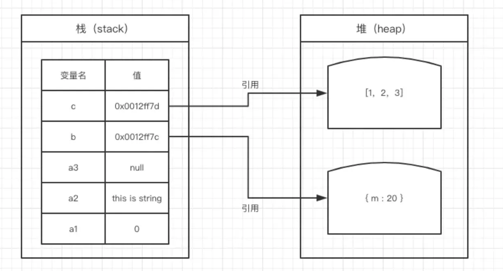

# 栈堆执行栈和 Eventloop

[TOC]

### JS 的内存机制

在 JavaScript 中会采用垃圾回收机制，JavaScript 会周期性的检查没有使用的变量并将其回收，处于闭包中的变量不会被回收或者在闭包中使用了外部的变量也不会被回收。

**垃圾回收：找出那些不再继续使用的变量，然后释放其占用的内存，垃圾收集器会按照固定的时间间隔周期性地执行这一操作。**

JS 中每一个变量都需要内存空间，内存空间又分为栈空间(stack)和堆空间(heap)。

### 栈空间

在栈空间中一般储存基本数据类型:

**Number String undefined Boolean Null Symbol**

比如定义一个变量

```js
var num=1
```

定义变量时，在栈空间内开辟了一片空间，可以直接操作保存在栈空间中的值，所以基本数据类型都是按值访问。

数据在栈中和数据结构的栈空间结构类似，**都是先进后出**

### 堆空间

堆内存中一般储存的是引用数据类型

JS 中的引用数据类型长度不固定，而且 JS 不允许直接访问堆空间，也就不能直接操作堆空间中的值。



当我们要访问堆内存中的引用数据类型时，实际上我们首先是从栈中获取了该对象的指针，然后再从堆内存中取得我们需要的数据。

所以基本类型的赋值不会互相影响，但是引用数据类型会影响

**总结**

- JavaScript 具备自动垃圾回收机制
- JS 内存分为堆内存和栈内存
- 引用类型在栈中保存指针，在堆中保存对象值
- 栈内存数据遵循**先进后出**

### Eventloop

##### 执行栈

JS 中所有代码的运行都是存放在执行栈中的，遵循入栈出栈，直到栈被清空。

JS 代码在运行前都会创建执行上下文，也可以理解为执行环境，JS 中有三种执行上下文：

- 全局执行上下文，默认的，在浏览器中是 window 对象
- 函数执行上下文，JS 的函数每当被调用时会创建一个上下文。
- Eval 执行上下文，eval 函数会产生自己的上下文。

通常，我们的代码中都不止一个上下文，那这些上下文的执行顺序应该是怎样的？从上往下依次执行？

栈，是一种数据结构，遵循先进后出的原则。JS 中的执行栈就具有这样的结构，当引擎第一次遇到 JS 代码时，会产生一个全局执行上下文并压入执行栈，每遇到一个函数调用，就会往栈中压入一个新的上下文。引擎执行栈顶的函数，执行完毕，弹出当前执行上下文。

```js
function foo() {
  console.log('1');
  bar();
  console.log('3');
}
function bar() {
  console.log('2');
}
foo();
```

执行栈的调用：


EC 值`Execute Context`执行上下文
