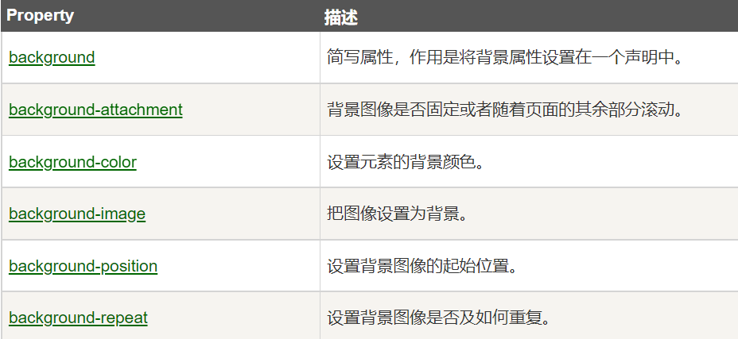

# CSS 背景&文本属性

[TOC]

### css 背景

CSS 背景属性用于定义 HTML 元素的背景。

CSS 属性定义背景效果:

- background-color
- background-image
- background-repeat
- background-attachment
- background-position

#### 背景颜色

background-color 属性定义了元素的背景颜色.

页面的背景颜色使用在 body 的选择器中:

```css
body {
  background-color: #b0c4de;
}
```

CSS 中，颜色值通常以以下方式定义:

- 十六进制 - 如："#ff0000"
- RGB - 如："rgb(255,0,0)"
- 颜色名称 - 如："red"

以下实例中, h1, p, 和 div 元素拥有不同的背景颜色:

```css
h1 {
  background-color: #6495ed;
}
p {
  background-color: #e0ffff;
}
div {
  background-color: #b0c4de;
}
```

---

#### 背景图像

background-image 属性描述了元素的背景图像.

默认情况下，背景图像进行平铺重复显示，以覆盖整个元素实体.

页面背景图片设置实例:

```css
body {
  background-image: url("paper.gif");
}
```

#### 背景图像-水平或垂直平铺

默认情况下 background-image 属性会在页面的水平或者垂直方向平铺。

一些图像如果在水平方向与垂直方向平铺，这样看起来很不协调,如果图像只在水平方向平铺 (repeat-x), 页面背景会更好些。

```css
body {
  background-image: url("gradient2.png");
  background-repeat: repeat-x;
}
```

#### 背景图像-设置定位或不平铺

让背景图像不影响文本的排版

如果你不想让图像平铺，你可以使用 background-repeat 属性:

```css
body {
  background-image: url("img_tree.png");
  background-repeat: no-repeat;
}
```

以上实例中，背景图像与文本显示在同一个位置，为了让页面排版更加合理，不影响文本的阅读，我们可以改变图像的位置。

可以利用 background-position 属性改变图像在背景中的位置:

```css
body {
  background-image: url("img_tree.png");
  background-repeat: no-repeat;
  background-position: right top;
}
```

#### 背景-简写属性

在以上实例中我们可以看到页面的背景颜色通过了很多的属性来控制。

为了简化这些属性的代码，我们可以将这些属性合并在同一个属性中.

背景颜色的简写属性为 "background":

```css
body {
  background: #ffffff url("img_tree.png") no-repeat right top;
}
```

当使用简写属性时，属性值的顺序为：:

- background-color
- background-image
- background-repeat
- background-attachment
- background-position

#### css 背景属性



### CSS 文本属性

#### 文本颜色

颜色属性被用来设置文字的颜色。

颜色是通过 CSS 最经常的指定：

- 十六进制值 - 如: **＃FF0000**
- 一个 RGB 值 - 如: **RGB(255,0,0)**
- 颜色的名称 - 如: **red**

```css
body {
  color: red;
}
h1 {
  color: #00ff00;
}
h2 {
  color: rgb(255, 0, 0);
}
```

对于 W3C 标准的 CSS：如果你定义了颜色属性，你还必须定义背景色属性。

#### 文本的对齐方式

文本排列属性是用来设置文本的水平对齐方式。

文本可居中或对齐到左或右,两端对齐.

当 text-align 设置为"justify"，每一行被展开为宽度相等，左，右外边距是对齐（如杂志和报纸）。

```css
h1 {
  text-align: center;
}
p.date {
  text-align: right;
}
p.main {
  text-align: justify;
}
```

#### 文本修饰

ext-decoration 属性用来设置或删除文本的装饰。

从设计的角度看 text-decoration 属性主要是用来删除链接的下划线：

```css
a {
  text-decoration: none;
}
```

#### 文本转换

文本转换属性是用来指定在一个文本中的大写和小写字母。

可用于所有字句变成大写或小写字母，或每个单词的首字母大写。

```css
p.uppercase {
  text-transform: uppercase;
}
p.lowercase {
  text-transform: lowercase;
}
p.capitalize {
  text-transform: capitalize;
}
```

#### 文本缩进

文本缩进属性是用来指定文本的第一行的缩进。

```css
p {
  text-indent: 50px;
}
```

#### 所有 css 的文本属性

| 属性                                                                          | 描述                     |
| :---------------------------------------------------------------------------- | :----------------------- |
| [color](https://www.runoob.com/cssref/pr-text-color.html)                     | 设置文本颜色             |
| [direction](https://www.runoob.com/cssref/pr-text-direction.html)             | 设置文本方向。           |
| [letter-spacing](https://www.runoob.com/cssref/pr-text-letter-spacing.html)   | 设置字符间距             |
| [line-height](https://www.runoob.com/cssref/pr-dim-line-height.html)          | 设置行高                 |
| [text-align](https://www.runoob.com/cssref/pr-text-text-align.html)           | 对齐元素中的文本         |
| [text-decoration](https://www.runoob.com/cssref/pr-text-text-decoration.html) | 向文本添加修饰           |
| [text-indent](https://www.runoob.com/cssref/pr-text-text-indent.html)         | 缩进元素中文本的首行     |
| [text-shadow](https://www.runoob.com/cssref/css3-pr-text-shadow.html)         | 设置文本阴影             |
| [text-transform](https://www.runoob.com/cssref/pr-text-text-transform.html)   | 控制元素中的字母         |
| [unicode-bidi](https://www.runoob.com/cssref/pr-text-unicode-bidi.html)       | 设置或返回文本是否被重写 |
| [vertical-align](https://www.runoob.com/cssref/pr-pos-vertical-align.html)    | 设置元素的垂直对齐       |
| [white-space](https://www.runoob.com/cssref/pr-text-white-space.html)         | 设置元素中空白的处理方式 |
| [word-spacing](https://www.runoob.com/cssref/pr-text-word-spacing.html)       | 设置字间距               |
