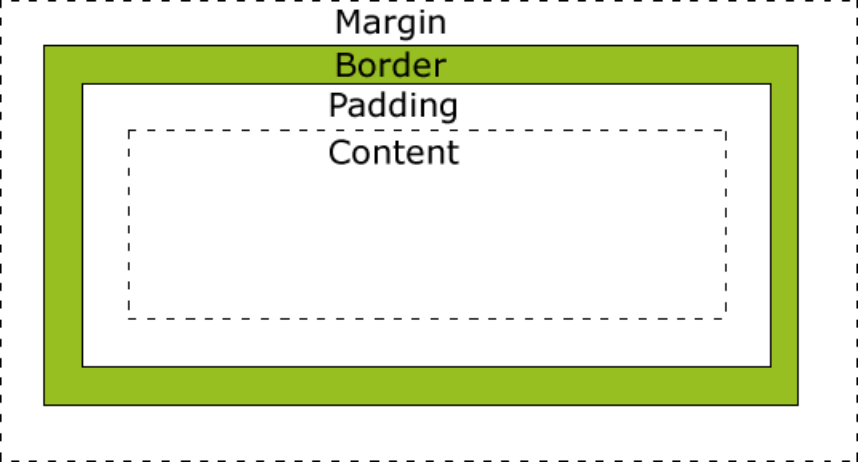

# CSS 表格&盒子&边框

[TOC]

### CSS 表格

使用 CSS 可以使 HTML 表格更美观。

#### 表格边框

指定 CSS 表格边框，使用 border 属性。

#### 表格宽度和高度

Width 和 height 属性定义表格的宽度和高度。

下面的例子是设置 100％的宽度，50 像素的 th 元素的高度的表格：

```css
table {
  width: 100%;
}
th {
  height: 50px;
}
```

#### 表格文字对齐

表格中的文本对齐和垂直对齐属性。

text-align 属性设置水平对齐方式，向左，右，或中心

```css
td {
  text-align: right;
}
```

垂直对齐属性设置垂直对齐，比如顶部，底部或中间：

```css
td {
  height: 50px;
  vertical-align: bottom;
}
```

#### 表格填充

如需控制边框和表格内容之间的间距，应使用 td 和 th 元素的填充属性：

```css
td {
  padding: 15px;
}
```

### CSS 盒子模型

所有 HTML 元素可以看作盒子，在 CSS 中，"box model"这一术语是用来设计和布局时使用。

CSS 盒模型本质上是一个盒子，封装周围的 HTML 元素，它包括：边距，边框，填充，和实际内容。

盒模型允许我们在其它元素和周围元素边框之间的空间放置元素。



不同部分的说明：

- **Margin(外边距)** - 清除边框外的区域，外边距是透明的。
- **Border(边框)** - 围绕在内边距和内容外的边框。
- **Padding(内边距)** - 清除内容周围的区域，内边距是透明的。
- **Content(内容)** - 盒子的内容，显示文本和图像。

#### 宽度和高度

最终元素的总宽度计算公式是这样的：

总元素的宽度=宽度+左填充+右填充+左边框+右边框+左边距+右边距

元素的总高度最终计算公式是这样的：

总元素的高度=高度+顶部填充+底部填充+上边框+下边框+上边距+下边距

### CSS 边框

CSS 边框属性允许你指定一个元素边框的样式和颜色

#### 边框样式

边框样式属性指定要显示什么样的边界。

**border-style**属性用来定义边框的样式

- dotted: 定义一个点线边框
- dashed: 定义一个虚线边框
- solid: 定义实线边框
- double: 定义两个边框。 两个边框的宽度和 border-width 的值相同
- groove: 定义 3D 沟槽边框。效果取决于边框的颜色值
- ridge: 定义 3D 脊边框。效果取决于边框的颜色值
- inset:定义一个 3D 的嵌入边框。效果取决于边框的颜色值
- outset: 定义一个 3D 突出边框。 效果取决于边框的颜色值

#### 边框宽度

您可以通过 border-width 属性为边框指定宽度。

为边框指定宽度有两种方法：可以指定长度值，比如 2px 或 0.1em(单位为 px, pt, cm, em 等)，或者使用 3 个关键字之一，它们分别是 thick 、medium（默认值） 和 thin。

#### 边框颜色

border-color 属性用于设置边框的颜色。可以设置的颜色：

- name - 指定颜色的名称，如 "red"
- RGB - 指定 RGB 值, 如 "rgb(255,0,0)"
- Hex - 指定 16 进制值, 如 "#ff0000"

您还可以设置边框的颜色为"transparent"。

**注意：** border-color 单独使用是不起作用的，必须得先使用 border-style 来设置边框样式。

```css
p.one {
  border-style: solid;
  border-color: red;
}
p.two {
  border-style: solid;
  border-color: #98bf21;
}
```

#### 单独设置各边

在 CSS 中，可以指定不同的侧面不同的边框：

```css
p {
  border-top-style: dotted;
  border-right-style: solid;
  border-bottom-style: dotted;
  border-left-style: solid;
}
```

- border-style:dotted solid double dashed;
  - 上边框是 dotted
  - 右边框是 solid
  - 底边框是 double
  - 左边框是 dashed
- border-style:dotted solid double;
  - 上边框是 dotted
  - 左、右边框是 solid
  - 底边框是 double
- border-style:dotted solid;
  - 上、底边框是 dotted
  - 右、左边框是 solid
- border-style:dotted;
  - 四面边框是 dotted

#### 边框简写

属性顺序：

- border-width
- border-style (required)
- border-color

```css
border: 5px solid red;
```
