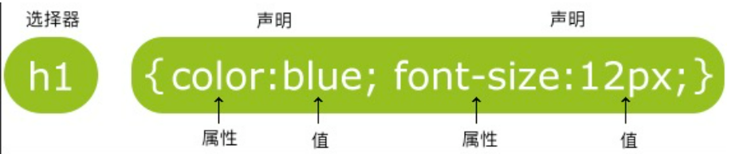

# CSS 学习

[TOC]

#### 什么是 CSS？

- CSS 指层叠样式表 (**C**ascading **S**tyle **S**heets)
- 样式定义**如何显示** HTML 元素
- 样式通常存储在**样式表**中
- 把样式添加到 HTML 4.0 中，是为了**解决内容与表现分离的问题**
- **外部样式表**可以极大提高工作效率
- 外部样式表通常存储在 **CSS 文件**中
- 多个样式定义可**层叠**为一个

#### CSS 规则

CSS 规则由两个主要的部分构成：选择器，以及一条或多条声明:



选择器通常是您需要改变样式的 HTML 元素。

每条声明由一个属性和一个值组成。

属性（property）是您希望设置的样式属性（style attribute）。每个属性有一个值。属性和值被冒号分开。

#### CSS 注释

注释是用来解释你的代码，并且可以随意编辑它，浏览器会忽略它。

CSS 注释以 [^/*]开始, 以 [^/*] 结束。

#### id 和 class 选择器

**id 和 class 选择器**

如果你要在 HTML 元素中设置 CSS 样式，你需要在元素中设置"id" 和 "class"选择器

##### id 选择器

id 选择器可以为标有特定 id 的 HTML 元素指定特定的样式。

HTML 元素以 id 属性来设置 id 选择器,CSS 中 id 选择器以 "#" 来定义。

##### class 选择器

class 选择器用于描述一组元素的样式，class 选择器有别于 id 选择器，class 可以在多个元素中使用。

class 选择器在 HTML 中以 class 属性表示, 在 CSS 中，类选择器以一个点"."号显示：

#### CSS 创建

##### 如何插入样式表

插入样式表的方法有三种:

- 外部样式表(External style sheet)
- 内部样式表(Internal style sheet)
- 内联样式(Inline style)

##### 外部样式表

当样式需要应用于很多页面时，外部样式表将是理想的选择。在使用外部样式表的情况下，你可以通过改变一个文件来改变整个站点的外观。每个页面使用 <link> 标签链接到样式表。 <link> 标签在（文档的）头部：

```html
<head>
  <link rel="stylesheet" type="text/css" href="mystyle.css" />
</head>
```

浏览器会从文件 `mystyle.css` 中读到样式声明，并根据它来格式文档。

外部样式表可以在任何文本编辑器中进行编辑。文件不能包含任何的 html 标签。样式表应该以 .css 扩展名进行保存。下面是一个样式表文件的例子：

```css
hr {
  color: sienna;
}
p {
  margin-left: 20px;
}
body {
  background-image: url("/images/back40.gif");
}
```

##### 内部样式表

当单个文档需要特殊的样式时，就应该使用内部样式表。你可以使用 <style> 标签在文档头部定义内部样式表，就像这样:

```html
<head>
  <style>
    hr {
      color: sienna;
    }
    p {
      margin-left: 20px;
    }
    body {
      background-image: url("images/back40.gif");
    }
  </style>
</head>
```

##### 内联样式表

由于要将表现和内容混杂在一起，内联样式会损失掉样式表的许多优势。请慎用这种方法，例如当样式仅需要在一个元素上应用一次时。

要使用内联样式，你需要在相关的标签内使用样式（style）属性。Style 属性可以包含任何 CSS 属性。本例展示如何改变段落的颜色和左外边距：

```html
<p style="color:sienna;margin-left:20px">这是一个段落。</p>
```

##### 多重样式

如果某些属性在不同的样式表中被同样的选择器定义，那么属性值将从更具体的样式表中被继承过来。

##### 多重样式的优先级

样式表允许以多种方式规定样式信息。样式可以规定在单个的 HTML 元素中，在 HTML 页的头元素中，或在一个外部的 CSS 文件中。甚至可以在同一个 HTML 文档内部引用多个外部样式表。

一般情况下，优先级如下：

**（内联样式）Inline style > （内部样式）Internal style sheet >（外部样式）External style sheet > 浏览器默认样式**
