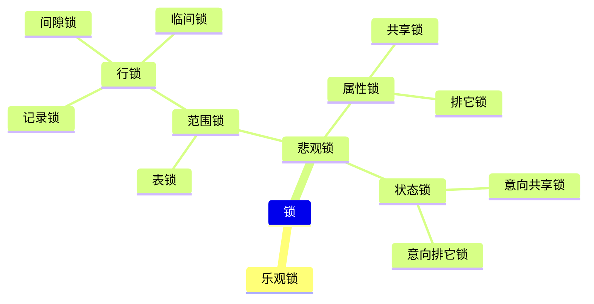

# 数据库

[TOC]

### 三层模式两层映射

- 外模式(视图)用户级数据库
- 概念模式(表)概念级数据库
- 内模式(文件)物理级数据库

外模式到概念模式映射（保证数据逻辑稳定性），概念模式和内模式映射（保证数据物理稳定性）。

**数据库设计过程：** 需求分析（数据流图），概念结构分析（ER 模型），逻辑结构分析（关系模式，表），物理模式（存储方式）。

**数据模式三要素：** 数据结构，数据操作，完整性约束。

### 数据流图

概念：以图形方式描述数据在系统中的流动和处理的过程。

**数据字典：** 定义数据流图中的各个成分。
**判定表/判定树：** 对加工处理的描述。

### 概念模型（ER 图）

实体：具有相同属性的集合

属性：简单属性（不可细分），复合属性（可细分），单值属性和多值属性（一个属性对应值个数），Null，派生属性（通过其他属性得知的属性）。

联系：1 对 1(1:1),1 对 n(1:n 或者 1:\*),多对多(n:m)

### 关系模型

- 规范化理论

1. 主键:该属性组可以唯一标识到一条记录，该属性组就是主键，主键是唯一的(实体完整性)，逐件取值唯一不允许为空。
2. 复合键：多个字段组合起来作为一个索引，一般用于复合主键。
3. 外键：用于和另一张表进行连接，比如 A 表的一个键是 B 表的主键，所以该键为 A 表的外键。

- ER 图转关系模式

1. 通用可以一个实体转一个表，实体与实体之间的关系转一个表。
2. 1：1 的关系模式时可以将关系归并到其中一个表中。
3. 1：n 的关系模式时可以将关系归并到 n 端的表中。
4. n:m 的关系模式时必须将关系单独转一个表。

### 关系运算

- 并，交，差

1. 并：将两张表合并，重复的去除。
2. 交：将两张表取相同的部分生成新表。
3. 差：A-B 表示在 A 表中去除 B 表中也有的，然后生成新表，B-A 表示在 B 表中去除 A 表也有的，然后生成新表。

- 笛卡尔积，投影和选择

1. 笛卡尔积：运算符为`×`,两张表的列相加,并且表 1 的每行和表二的每行分别连接。
2. 投影：运算符为 Π~所需要的列~（表名）,然后选择需要的列生成新表，重复的去除。
3. 选择：选择运算符为 $\sigma_行(表名)$ 在对应的表中选择 $\sigma$ 里面符合条件的行，生成新表。

- 自然连接：两表自然连接，首先找到相同的列，然后在相同的列中找到相同的行，将两表中所有的列结合，然后去重，最后生成新表。

### 锁

### 乐观锁

乐观锁是相对悲观锁而言的，乐观锁假设数据一般情况下不会造成冲突，所以在数据进行提交更新的时候，才会正式对数据的冲突与否进行检测，如果发现冲突了，则返回给用户错误的信息，让用户决定如何去做。

### 悲观锁

悲观锁，对数据被外界（包括本系统当前的其他事务，以及来自外部系统的事务处理）修改持保守态度，因此，在整个数据处理过程中，将数据处于锁定状态。

#### 共享锁

共享锁，又称之为读锁，简称S锁，当事务A对数据加上读锁后，其他事务只能对该数据加读锁，不能做任何修改操作，也就是不能添加写锁。只有当事务A上的读锁被释放后，其他事务才能对其添加写锁。

#### 排它锁

排它锁，又称之为写锁，简称X锁，当事务对数据加上写锁后，其他事务既不能对该数据添加读写，也不能对该数据添加写锁，写锁与其他锁都是互斥的。只有当前数据写锁被释放后，其他事务才能对其添加写锁或者是读锁。

#### 行锁

当数据库表有一个主键索引和一个普通索引，通过这两个索引的查询语句命中 n 条记录之后，此时这 n 条记录记录就被锁定，此时其它想访问该表时，被锁定的记录不能访问。
**行锁的特征：锁冲突概率低，并发性高，但是会有死锁的情况出现。**

##### 记录锁

行锁是命中索引，一锁锁的是一张表的一条记录或者是多条记录，记录锁是在行锁上衍生的锁。
记录锁锁的是表中的某一条记录，记录锁的出现条件必须是精准命中索引并且索引是唯一索引。

##### 间隙锁

间隙锁又称之为区间锁，每次锁定都是锁定一个区间，隶属行锁。既然间隙锁隶属行锁，那么，间隙锁的触发条件必然是命中索引的，当查询数据用范围查询而不是相等条件查询时，查询条件命中索引，并且没有查询到符合条件的记录，此时就会将查询条件中的范围数据进行锁定(即使是范围库中不存在的数据也会被锁定)

##### 临键锁

mysql 的行锁默认就是使用的临键锁，临键锁是由记录锁和间隙锁共同实现的，上面间隙锁的触发条件是命中索引，范围查询没有匹配到相关记录。而临键锁恰好相反，临键锁的触发条件也是查询条件命中索引，不过，临键锁有匹配到数据库记录。

#### 表锁

表锁就是一锁锁一整张表，在表被锁定期间，其他事务不能对该表进行操作，必须等当前表的锁被释放后才能进行操作。表锁响应的是非索引字段，即全表扫描，全表扫描时锁定整张表。
**由于表锁每次都是锁一整张表，所以表锁的锁冲突几率特别高，表锁不会出现死锁的情况。**
