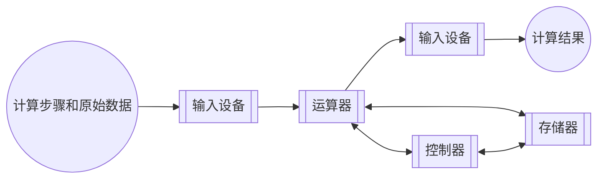

# 计算机基本硬件组成

[TOC]

## 冯.诺伊曼结构

> “程序存储”：指令以代码的形式事先输入到计算机的主存储器中，然后按其在存储器中的首地址执行程序的第一条指令，以后就按该程序的规定顺序执行其他指令，直至程序执行结束。即按地址访问并顺序执行指令

计算机按照此原理应具有 5 大功能：数据传送功能、数据存储功能、数据处理功能、操作控制功能、操作判断功能。

冯诺依曼结构的特点:

- 计算机硬件系统由五大部件组成(存储器，计算器，控制器，输入设备，输出设备)
- 指令和数据以同等的地位存于存储器，可以按照地址访问。
- 指令和数据以二进制表示
- 指令由操作码和地址码组成
- 存储程序
- 以运算器为中心

冯诺伊曼结构:

### 计算机功能部件

1. 输入设备：是指将外部信息以计算机能读懂的方式输入进来，如键盘，鼠标等。
2. 输出设备：就是将计算机处理的信息以人所能接受的方式输出出来，比如显示屏，打印机。
3. 存储器：分为主存储器(内存储器，CPU 能直接访问)和 辅助存储器(外存储器，协助主存储器记忆更多的信息，辅助存储器的信息需要导入到主存储器中，才可以被 CPU 访问)。
4. 运算器：是计算机的运算单元，用于算术运算和逻辑运算，运算器的核心单元是算术逻辑单元(ALU)。
5. 控制器是计算机的指挥中心，有其指挥各部件自动协调第进行工作，现代计算机将运算器和控制器集成到一个芯片上，合成为中央处理器，简称CPU。有程序计数器(PC)、指令寄存器(IR)和控制单元(CU)。

>一般将运算器和控制器集成到同一个芯片上，称为中央处理器(CPU)。CPU和主存储器共同构成主机，而除主机外的其他硬件装置(外存、I/O设备等)统称为外部设备，简称外设。